# Mesa ABM 双边平台竞争实验报告

## 摘要

本报告基于 Mesa 多智能体仿真框架，研究双边平台竞争中个体异质性、补贴策略、冷启动资源配置和商户多归属机制对市场结构的影响。模型将用户和商户分别表示为智能体，智能体根据平台效用、双边网络效应、补贴、惯性和随机偏好进行平台选择。

实验重点不是简单观察平台份额变化，而是识别市场锁定与平台共存之间的临界条件。报告首先通过 ABM 与 ODE 的模型衔接实验说明多智能体仿真相对于平均场模型的解释价值，随后依次考察临界区异质性、服务质量优势、等预算补贴、冷启动二维资源配比、商户多归属和机制消融。结果表明，双边平台竞争的最终格局不仅取决于网络效应强度，还受到个体差异、服务质量、补贴投向、初始双边资源结构和商户归属方式的共同影响。机制消融进一步说明，双边网络效应和商户多归属是弱势平台跨越临界区的重要支撑机制。

## 1. 实验背景

双边平台同时连接用户侧和商户侧。用户选择平台时会受到商户供给规模影响，商户选择平台时又会受到用户流量规模影响，因此平台竞争具有典型的双边网络效应。

在这种环境中，市场可能出现三类结果：

- 平台 A 锁定：多数用户和商户最终集中到平台 A；
- 平台 B 锁定：多数用户和商户最终集中到平台 B；
- 双平台共存：用户和商户在两个平台之间保持相对分散。

传统平均场模型通常描述总体份额的演化，但难以细致刻画用户和商户之间的个体差异、局部随机性、定向补贴和多归属行为。ABM 的价值在于从微观主体决策出发，观察大量个体选择如何累积成宏观市场结构。

## 2. 模型设定

### 2.1 智能体类型

模型包含两类智能体：

| 智能体 | 决策内容 | 主要影响因素 |
|---|---|---|
| 用户 agent | 选择平台 A 或 B | 服务质量、价格、商户供给、补贴、惯性、偏好噪声 |
| 商户 agent | 选择 A-only、B-only 或 multi-home | 用户流量、抽成、补贴、多归属成本、惯性、偏好噪声 |

用户和商户均具有个体属性，例如价格敏感度、质量敏感度、补贴敏感度、惯性、流量敏感度和抽成敏感度。这些属性由异质性参数控制。

本文所说的“个体异质性强度”记为 \(\sigma_\theta\)，表示用户和商户之间偏好差异的大小。模型中每个主体的敏感度不是固定为同一个值，而是在平均水平附近随机生成：

\[
\theta_i \sim N(\bar{\theta},\sigma_\theta^2)
\]

其中 \(\theta_i\) 表示个体 \(i\) 的某类敏感度，例如价格敏感度、质量敏感度、补贴敏感度或惯性；\(\bar{\theta}\) 表示平均敏感度；\(\sigma_\theta\) 越大，说明主体之间差异越大。当 \(\sigma_\theta=0\) 时，用户和商户几乎同质；当 \(\sigma_\theta\) 较大时，市场中会同时存在非常价格敏感、非常质量敏感、非常补贴敏感或非常惯性的主体。

因此，异质性强度不是某一种偏好本身，而是控制所有个体偏好分散程度的参数。它用于研究：当市场主体差异更大时，平台竞争是否更容易赢家通吃，还是会保留更多分散和共存空间。

用户异质性分为四类：

| 用户类型 | 主要特征 | 在效用函数中的作用 |
|---|---|---|
| price_sensitive | 对价格更敏感 | 平台价格或使用成本上升时，更容易离开该平台 |
| quality_sensitive | 对服务质量更敏感 | 当平台存在质量差异时，更容易选择服务质量更高的平台 |
| subsidy_sensitive | 对补贴更敏感 | 更容易被优惠券、返利、折扣等补贴吸引 |
| inertial | 惯性更强 | 更倾向于留在当前平台，切换平台概率更低 |

商户异质性也分为四类：

| 商户类型 | 主要特征 | 在效用函数中的作用 |
|---|---|---|
| traffic_sensitive | 对用户流量更敏感 | 更倾向于进入用户规模更大的平台 |
| cost_sensitive | 对抽成或经营成本更敏感 | 对平台佣金、跨平台经营成本更敏感 |
| subsidy_sensitive | 对补贴更敏感 | 更容易受到商户侧补贴或扶持政策影响 |
| inertial | 惯性更强 | 更倾向于维持原有平台归属 |

在服务质量优势实验中，平台 A 与 B 的服务质量差异被显式设为实验变量；在补贴、冷启动和多归属实验中，服务质量保持一致，以便隔离对应机制的作用。由此，质量敏感型用户既可以在质量差异场景中体现选择偏好，也不会干扰其他机制实验的识别。

### 2.2 仿真规模与类型数量

除特别说明外，ABM 实验统一采用如下仿真规模：

| 项目 | 取值 | 说明 |
|---|---:|---|
| 用户数量 | 300 | 表示平台用户侧主体规模 |
| 商户数量 | 150 | 表示平台供给侧主体规模 |
| 仿真步数 | 70 | 表示平台竞争的离散演化周期 |
| 用户类型数 | 4 | 价格敏感型、质量敏感型、补贴敏感型、惯性型 |
| 商户类型数 | 4 | 流量敏感型、成本敏感型、补贴敏感型、惯性型 |

用户和商户类型在初始化时等概率随机分配。因此，每次重复实验中的具体类型数量会有小幅随机波动，但其期望数量是固定的：

| 主体 | 类型 | 单次实验期望数量 |
|---|---|---:|
| 用户 | price_sensitive | 75 |
| 用户 | quality_sensitive | 75 |
| 用户 | subsidy_sensitive | 75 |
| 用户 | inertial | 75 |
| 商户 | traffic_sensitive | 37.5 |
| 商户 | cost_sensitive | 37.5 |
| 商户 | subsidy_sensitive | 37.5 |
| 商户 | inertial | 37.5 |

这里选择 300 名用户和 150 个商户，是为了在计算量可控的前提下保留足够的主体差异。用户数量高于商户数量，符合双边平台中用户侧通常规模更大、商户侧供给更稀缺的设定。重复实验通过不同随机种子生成类型分布和个体敏感度，从而估计同一参数组合下的结果概率。

### 2.3 双边网络效应

用户侧效用受到平台有效商户供给影响，商户侧效用受到平台用户份额影响。记平台 A 用户份额为 \(u_A\)，平台 A 有效商户供给为 \(m_A^{eff}\)，综合份额定义为：

\[
L_A(t)=\frac{u_A(t)+m_A^{eff}(t)}{2}
\]

其中 \(L_A(t)\) 是衡量平台 A 市场地位的核心指标。

网络效应系数 \(\alpha\) 和 \(\beta\) 分别表示双边反馈强度：\(\alpha\) 衡量商户供给对用户选择的影响，\(\beta\) 衡量用户流量对商户选择的影响。实验中主要使用 \(\alpha=\beta=2.3\) 和 \(\alpha=\beta=2.5\) 两组设定，其含义如下：

| 参数设定 | 使用场景 | 选择理由 |
|---|---|---|
| \(\alpha=\beta=2.3\) | 临界区异质性实验 | 该强度处于中等偏强的网络效应区间，平台 A 的 0.52 初始优势不会被完全抹平，也不会确定性地全部锁定，适合观察异质性如何改变锁定概率和结果波动 |
| \(\alpha=\beta=2.5\) | 服务质量、补贴、冷启动和机制消融实验 | 该强度形成更明显的双边正反馈和临界门槛，适合研究弱势平台如何通过质量、补贴或初始资源跨越启动阈值 |

这些系数不是基于真实平台数据拟合得到的预测参数，而是用于机制分析的情景参数。其作用是把系统放在具有明显路径依赖和临界转换的区间内，从而观察不同机制对市场锁定、平台共存和弱势平台逆袭概率的影响。

### 2.4 商户多归属

商户可以处于三种状态：

\[
A\text{-only},\quad B\text{-only},\quad multi\text{-home}
\]

多归属商户对平台 A 和 B 都产生有效供给贡献：

\[
M_A^{eff}=M_{A-only}+\rho M_{multi}
\]

\[
M_B^{eff}=M_{B-only}+\rho M_{multi}
\]

其中 \(\rho\in[0,1]\) 表示多归属商户对单个平台的有效供给贡献。

### 2.5 结果判定

仿真结束时，根据最终综合份额 \(L_A(\infty)\) 判定市场结果：

| 判定 | 条件 |
|---|---|
| 平台 A 锁定 | \(L_A(\infty)\ge 0.8\) |
| 平台 B 锁定 | \(L_A(\infty)\le 0.2\) |
| 双平台共存 | \(0.2<L_A(\infty)<0.8\) |

成功概率定义为：

\[
P(L_A(T)>0.6)
\]

其中 \(T\) 为仿真终止时间。

### 2.6 实验代码

实验代码入口：

```powershell
cd .\zl\AgentBasedModel_Mesa
python .\run_abm_experiments.py
```

核心代码文件：

```text
abm_experiment_model.py
run_abm_experiments.py
```

后续实验按照“模型衔接—核心机制—机制验证”的顺序展开。首先用 ABM 与 ODE 的对比说明多智能体模型和平均场模型之间的关系；随后分别考察异质性、服务质量、补贴策略、冷启动资源配比和商户多归属对竞争格局的影响；最后通过机制消融检验关键结论是否由双边网络效应、多归属、惯性和精准补贴规则共同支撑。

## 3. ABM 与 ODE 的模型衔接实验

### 3.1 实验目的与设计

ABM 与 ODE 的关系不是替代关系，而是“宏观平均场模型 + 微观机制扩展”的关系。ODE 提供平均场基准，用于描述总体份额演化和宏观临界区；ABM 在同一竞争机制下引入个体异质性、随机路径和多主体行为，从而观察平均趋势背后的结果分布。

本实验选择三个代表场景：

| 场景 | 目的 |
|---|---|
| 弱网络效应 | 检查两类模型是否都显示平台共存 |
| 强网络效应 | 检查两类模型是否都显示初始优势被放大为锁定 |
| 冷启动临界区 | 检查 ABM 是否出现更强随机性和路径依赖 |

ODE 输出确定性 \(L_A(t)\) 轨迹，ABM 在相同宏观参数下重复运行 30 次，输出 \(L_A(t)\) 的均值和标准差。

### 3.2 图像结果

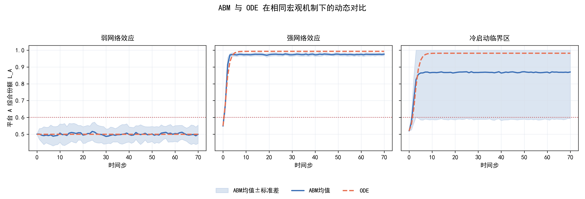

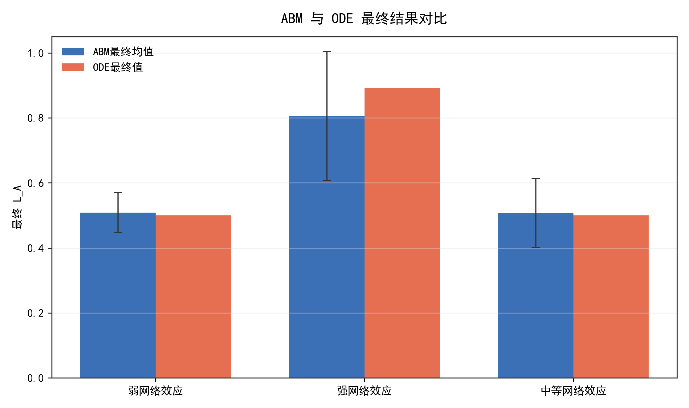

### 3.3 结果表格

| 场景 | ABM 最终 \(L_A\) 均值 | ABM 标准差 | ODE 最终 \(L_A\) | ABM 成功概率 | ABM A 锁定概率 | ABM 共存概率 |
|---|---:|---:|---:|---:|---:|---:|
| 弱网络效应 | 0.499 | 0.055 | 0.500 | 0.000 | 0.000 | 1.000 |
| 强网络效应 | 0.976 | 0.010 | 0.993 | 1.000 | 1.000 | 0.000 |
| 冷启动临界区 | 0.870 | 0.277 | 0.982 | 0.900 | 0.900 | 0.000 |

### 3.4 结果分析

弱网络效应场景下，ODE 和 ABM 都收敛到接近 \(L_A=0.5\) 的共存状态。ABM 的最终均值为 0.499，ODE 的最终值为 0.500，说明当交叉网络效应较弱时，微观随机性不足以形成系统性锁定。

强网络效应场景下，两类模型都显示平台 A 的轻微初始优势会被双边正反馈放大。ABM 最终均值为 0.976，ODE 最终值为 0.993，二者趋势一致。这说明 ABM 继承了 ODE 的基本宏观机制。

差异主要出现在冷启动临界区。ODE 给出的最终 \(L_A\) 为 0.982，表现为确定性地走向平台 A 优势；ABM 的最终均值为 0.870，但标准差达到 0.277，成功概率为 0.900。这说明在临界区内，平均场模型容易给出较平滑、较确定的跃迁判断，而 ABM 揭示了个体异质性和随机路径导致的结果分布：大部分路径能够成功跨越临界区，但仍存在少数路径未能形成稳定锁定。

因此，ABM 的价值不在于推翻 ODE，而在于对 ODE 识别出的临界区域进一步估计成功概率、波动范围和机制来源。ODE 回答“平均意义下是否会锁定”，ABM 进一步回答“在微观随机主体下，有多大概率锁定、哪些机制支撑锁定、结果波动有多大”。

## 4. 实验 A：临界区异质性实验

### 4.1 实验目的

本实验研究个体异质性是否会改变市场锁定概率、结果方差和市场集中度。实验将平台 A 设定为仅有轻微初始优势，使系统处于路径依赖较敏感的临界区域。

### 4.2 实验设置

基础参数：

```text
u_A(0)=0.52
m_A(0)=0.52
alpha=beta=2.3
```

其中 \(\alpha=\beta=2.3\) 用于构造临界竞争环境。若网络效应过弱，轻微初始优势难以被放大，市场更容易保持共存；若网络效应过强，平台 A 的 0.52 初始优势会过快转化为锁定，异质性作用反而不容易被区分。因此，本实验采用中等偏强的网络效应强度，使系统既具有路径依赖，又保留随机波动空间。

扫描个体异质性强度：

\[
\sigma_\theta\in\{0,0.25,0.5,0.75,1.0,1.25,1.5,2.0\}
\]

这里 \(\sigma_\theta\) 越大，表示用户和商户之间的价格敏感度、质量敏感度、补贴敏感度和惯性差异越大。本实验通过改变 \(\sigma_\theta\)，观察“主体越不一样”时，轻微领先的平台 A 是否更容易锁定市场，还是会因为偏好多样化而降低市场集中度。

每组重复运行 30 次。

### 4.3 图像结果

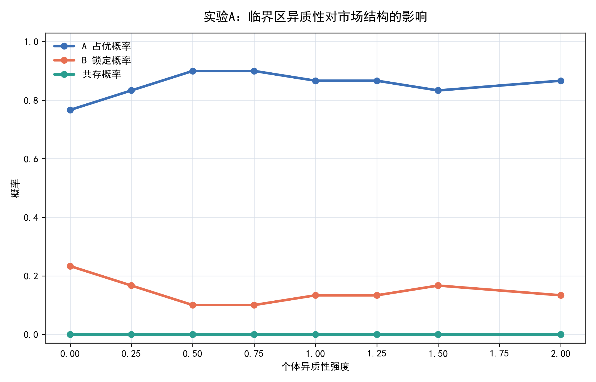

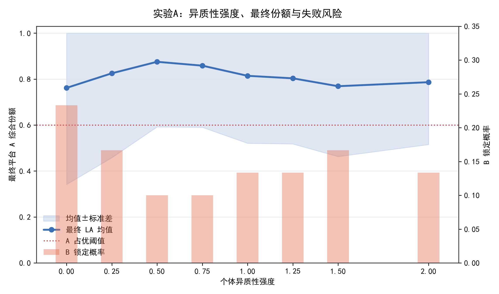

### 4.4 结果表格

| 异质性强度 | 最终 \(L_A\) 均值 | 最终 \(L_A\) 标准差 | A 成功概率 | A 锁定概率 | B 锁定概率 | 共存概率 | 市场集中度 |
|---:|---:|---:|---:|---:|---:|---:|---:|
| 0.00 | 0.7618 | 0.4204 | 0.7667 | 0.7667 | 0.2333 | 0.0000 | 0.9787 |
| 0.25 | 0.8252 | 0.3672 | 0.8333 | 0.8333 | 0.1667 | 0.0000 | 0.9723 |
| 0.50 | 0.8753 | 0.2834 | 0.9000 | 0.9000 | 0.1000 | 0.0000 | 0.9370 |
| 0.75 | 0.8586 | 0.2684 | 0.9000 | 0.9000 | 0.1000 | 0.0000 | 0.8964 |
| 1.00 | 0.8143 | 0.2936 | 0.8667 | 0.8667 | 0.1333 | 0.0000 | 0.8642 |
| 1.25 | 0.8034 | 0.2857 | 0.8667 | 0.8667 | 0.1333 | 0.0000 | 0.8420 |
| 1.50 | 0.7691 | 0.3062 | 0.8333 | 0.8333 | 0.1667 | 0.0000 | 0.8260 |
| 2.00 | 0.7866 | 0.2713 | 0.8667 | 0.8667 | 0.1333 | 0.0000 | 0.8066 |

### 4.5 结果分析

第二张图不再展示箱线图，而是同时展示最终 \(L_A\) 均值、均值上下一个标准差范围以及 B 锁定概率。蓝色折线表示平台 A 的平均最终份额，浅蓝色阴影表示结果波动范围，橙色柱表示少数随机路径中平台 B 反向锁定的概率。

当异质性为 0 时，A 锁定概率为 0.7667，B 锁定概率为 0.2333，说明在轻微初始优势下，市场结果仍具有明显随机性。

异质性从 0 增加到 0.5 时，A 锁定概率上升到 0.9000。这说明中等程度的异质性并不必然削弱初始优势，反而可能使部分高敏感用户和商户更快响应平台 A 的初始优势，从而放大双边网络效应。

当异质性继续提高时，最终 \(L_A\) 均值和市场集中度整体下降。例如 \(\sigma_\theta=2.0\) 时，最终 \(L_A\) 均值为 0.7866，市场集中度为 0.8066，明显低于中等异质性情形。这说明强异质性会削弱赢家通吃强度，使市场结果更分散。

本实验表明，个体异质性的作用具有非线性：中等异质性可能强化领先平台优势，而强异质性会降低市场集中程度。

### 4.6 类型分布分析

为了进一步解释异质性机制，实验记录了最终阶段不同用户类型和商户类型的平台分布。下图展示强异质性条件下，最终留在平台 A 的用户由哪些类型构成。

这一分析的作用在于把“异质性”从一个抽象参数拆解为具体主体类型。概率曲线用于刻画异质性强度对最终市场结构的影响，类型构成则进一步说明平台 A 的最终用户池由哪些主体组成。它可以回答两个更微观的问题：第一，平台 A 最终吸引来的用户是否集中在某一类，还是较均衡地覆盖多类用户；第二，用户侧优势是否会进一步吸引特定类型商户，从而形成双边反馈。

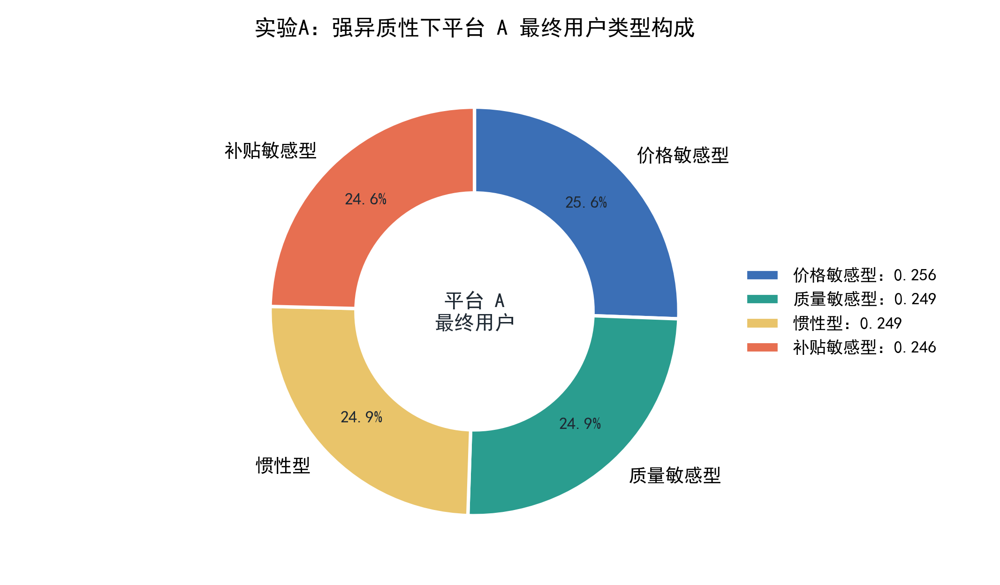

强异质性 \(\sigma_\theta=2.0\) 下，平台 A 最终用户构成如下：

| 用户类型 | 占平台 A 最终用户比例 |
|---|---:|
| 补贴敏感型 | 0.253 |
| 惯性型 | 0.252 |
| 质量敏感型 | 0.247 |
| 价格敏感型 | 0.247 |

商户类型分布如下：

| 商户类型 | A-only 占比 | B-only 占比 | Multi-home 占比 |
|---|---:|---:|---:|
| cost_sensitive | 0.735 | 0.265 | 0.000 |
| inertial | 0.725 | 0.275 | 0.000 |
| subsidy_sensitive | 0.743 | 0.257 | 0.000 |
| traffic_sensitive | 0.755 | 0.245 | 0.000 |

从用户侧看，最终留在平台 A 的用户构成比较均衡：四类用户各占约四分之一，其中补贴敏感型和惯性型略高，分别为 0.253 和 0.252；质量敏感型和价格敏感型略低，分别为 0.247 和 0.247。这说明平台 A 的最终优势并不是由某一种用户类型单独贡献的，而是覆盖了多类用户。换言之，A 的领先已经从初始优势扩展为较广泛的用户池优势。

从商户侧看，traffic_sensitive 商户的 A-only 占比最高，达到 0.755。这一结果更能解释双边网络效应的传导机制：当平台 A 形成较高用户份额后，重视流量的商户最容易被吸引到 A；商户供给增加后，又会进一步提高用户留在 A 的效用。也就是说，类型分布表明平台 A 的优势并不是单边形成的，而是通过“用户份额上升—流量敏感商户迁入—供给增强—用户继续留存”的反馈链条被放大。

同时，仍有约 24% 到 28% 的商户留在 B 平台，说明强异质性并不会让所有主体完全收敛到同一平台。部分成本敏感、惯性或补贴敏感商户仍可能因为自身偏好、切换成本或局部随机路径留在 B。这也解释了为什么实验 A 中强异质性会降低市场集中度：平台 A 保持总体优势，但异质偏好为平台 B 留下了一定生存空间。

## 5. 实验 B：服务质量优势实验

### 5.1 实验目的

本实验将服务质量差异作为独立策略变量，研究弱势平台 A 能否依靠服务质量优势跨越临界规模，并比较用户侧质量优势、商户侧质量优势和双边质量优势的效果差异。

该实验回答两个问题：

1. 服务质量优势能否替代补贴，帮助弱势平台逆袭？
2. 质量敏感型用户在服务质量差异存在时是否表现出更强的平台 A 留存倾向？

### 5.2 实验设置

平台 A 初始处于明显劣势：

```text
u_A(0)=0.30
m_A(0)=0.30
alpha=beta=2.5
heterogeneity_sigma=0.8
```

扫描平台 A 相对平台 B 的服务质量优势：

\[
\Delta q = q_A-q_B \in \{0,0.25,0.50,\dots,2.00\}
\]

比较五种情形：

| 策略 | 含义 |
|---|---|
| 无质量优势 | \(q_A=q_B=0\)，作为对照组 |
| 用户侧质量优势 | 仅提高平台 A 对用户侧的服务质量 |
| 商户侧质量优势 | 仅提高平台 A 对商户侧的服务质量 |
| 双边质量优势 | 同时提高平台 A 对用户和商户的服务质量 |
| 双边质量 + 少量精准补贴 | 在双边质量优势基础上加入少量双边精准补贴 |

每个质量差-策略组合重复运行 15 次。

### 5.3 图像结果

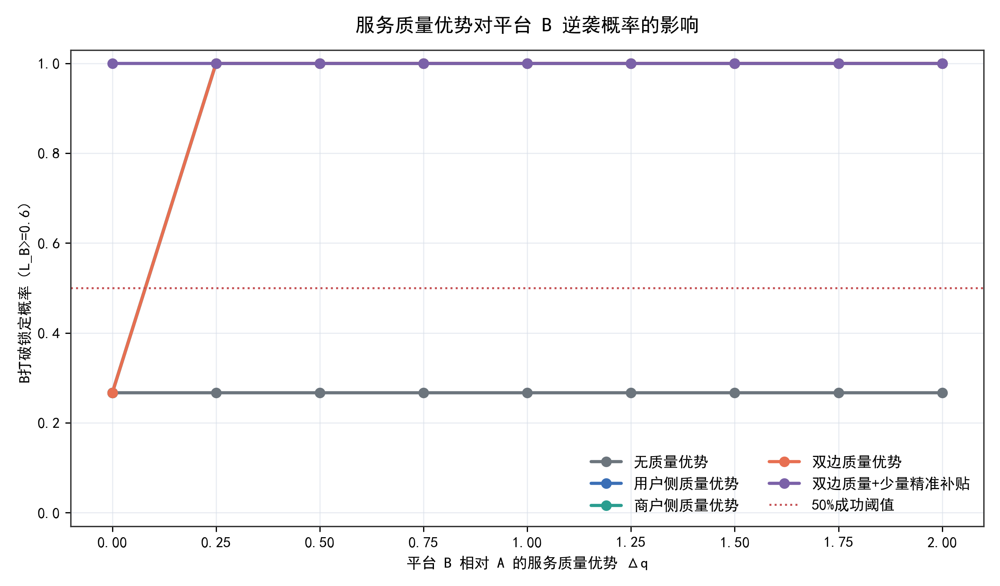

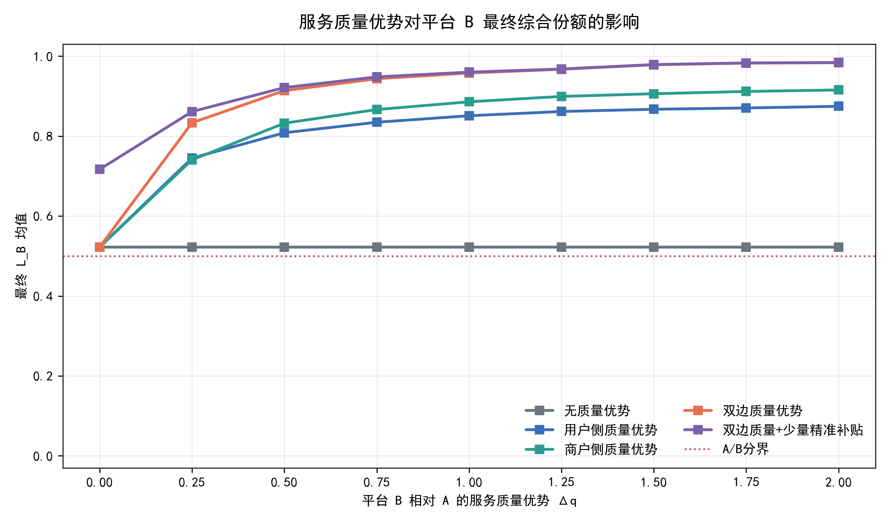

### 5.4 临界质量优势

以成功概率达到 0.5 作为临界标准，得到不同质量策略的临界质量优势：

| 质量策略 | 临界质量优势 \(\Delta q^*\) | 最大成功概率 | 最大最终 \(L_A\) 均值 |
|---|---:|---:|---:|
| 无质量优势 | - | 0.00 | 0.048 |
| 用户侧质量优势 | 0.75 | 1.00 | 0.959 |
| 商户侧质量优势 | 1.25 | 1.00 | 0.995 |
| 双边质量优势 | 0.50 | 1.00 | 0.998 |
| 双边质量 + 少量精准补贴 | 0.25 | 1.00 | 0.998 |

### 5.5 结果分析

结果显示，服务质量优势可以帮助弱势平台跨越临界规模，但效果取决于质量优势作用在哪一侧。仅提高用户侧质量时，平台 A 的临界质量优势约为 \(\Delta q^*=0.75\)；仅提高商户侧质量时，临界质量优势约为 \(\Delta q^*=1.25\)。这说明在当前参数下，直接改善用户侧体验比单独改善商户侧服务更容易触发早期用户迁移。

双边质量优势的效果明显更强。当平台 A 同时提升用户侧和商户侧服务质量时，临界质量优势降至 \(\Delta q^*=0.50\)。这与双边平台机制一致：用户体验提升会带来更多用户，更多用户又提高商户侧流量收益；商户服务改善吸引更多商户，更多供给又反过来提高用户侧效用。

最有效的是“双边质量 + 少量精准补贴”。当存在少量双边精准补贴时，临界质量优势进一步降至 \(\Delta q^*=0.25\)。这说明补贴和服务质量不是相互替代关系，而是可以形成互补：质量优势提高长期吸引力，精准补贴帮助平台更快跨过早期临界区。

### 5.6 用户类型响应

为了验证质量敏感型用户是否真正发挥作用，实验在 \(\Delta q=0.75\) 的临界附近记录不同用户类型的平台 A 留存比例。

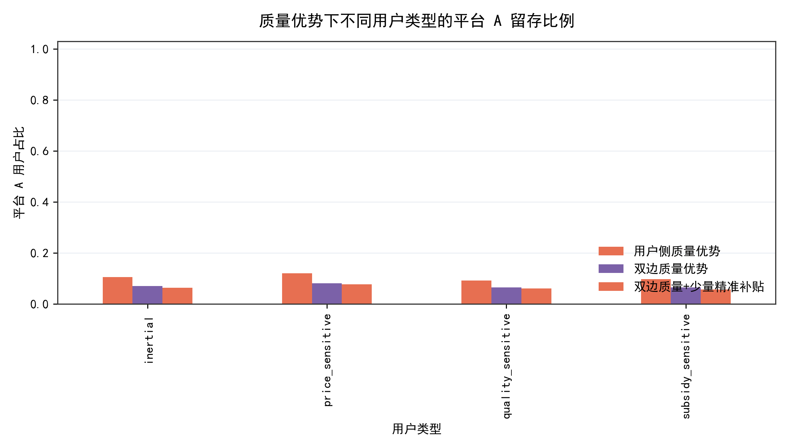

用户侧质量优势下，不同用户类型的平台 A 占比如下：

| 用户类型 | 平台 A 占比 |
|---|---:|
| inertial | 0.623 |
| price_sensitive | 0.643 |
| quality_sensitive | 0.700 |
| subsidy_sensitive | 0.635 |

可以看到，当平台 A 只具有用户侧质量优势时，quality_sensitive 用户的平台 A 占比最高，达到 0.700，高于价格敏感、补贴敏感和惯性用户。这说明服务质量差异被引入后，质量敏感型用户不再是空设定，而是会更明显地响应平台 A 的质量优势。

在双边质量优势或“双边质量 + 少量精准补贴”情形下，各类型用户的平台 A 占比都接近 1。这说明一旦平台 A 同时改善用户侧和商户侧质量，双边正反馈会迅速形成，用户类型差异被整体平台优势覆盖。

本实验说明，质量敏感度的解释力来自平台间服务质量差异；当服务质量被设为策略变量时，质量敏感型用户能够帮助解释弱势平台如何通过体验改善实现逆袭。

## 6. 实验 C：等预算补贴策略实验

### 6.1 实验目的

本实验研究在相同补贴预算下，不同补贴策略帮助弱势平台跨越临界规模的能力。平台 A 初始处于劣势，目标是通过补贴推动 \(L_A\) 超过 0.6。

### 6.2 实验设置

基础参数：

```text
u_A(0)=0.30
m_A(0)=0.30
alpha=beta=2.5
heterogeneity_sigma=0.8
```

扫描每期总补贴预算：

\[
B\in\{0,50,100,200,400,800,1200\}
\]

比较六种策略：

| 策略 | 含义 |
|---|---|
| 无补贴 | 不进行补贴 |
| 统一补贴 | 对全部用户和商户平均分配预算 |
| 随机补贴 | 随机选择部分用户和商户补贴 |
| 摇摆用户补贴 | 补贴低惯性、高补贴敏感度的用户 |
| 关键商户补贴 | 补贴关键、高流量敏感度的商户 |
| 双边精准补贴 | 同时补贴摇摆用户和关键商户 |

每个预算-策略组合重复运行 30 次。

### 6.3 图像结果

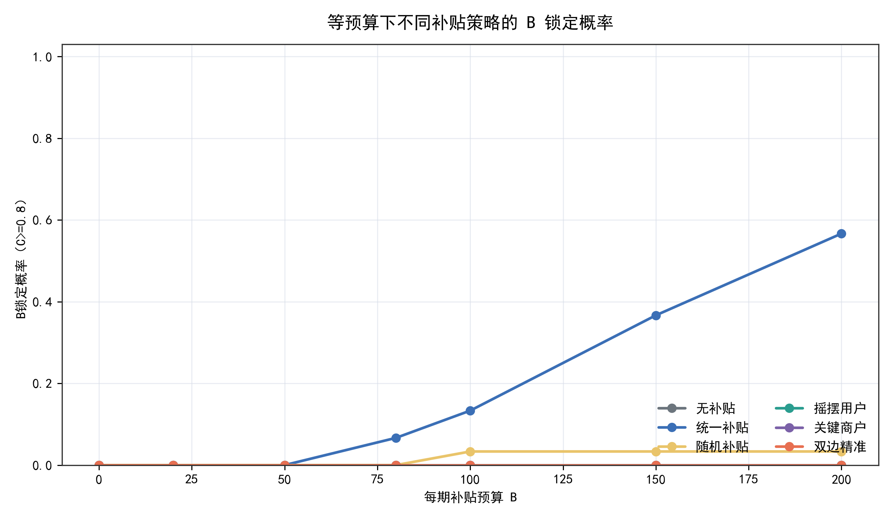

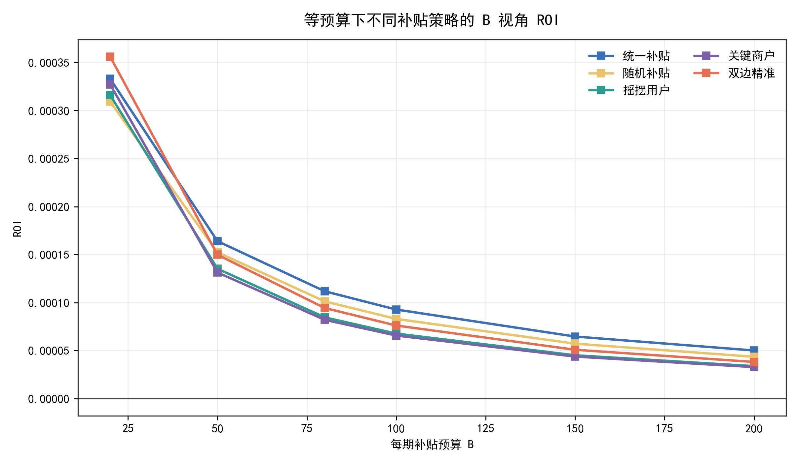

### 6.4 成功概率表

成功定义为最终 \(L_A>0.6\)。

| 预算 B | 关键商户 | 双边精准 | 摇摆用户 | 无补贴 | 统一补贴 | 随机补贴 |
|---:|---:|---:|---:|---:|---:|---:|
| 0 | 0.00 | 0.00 | 0.00 | 0.00 | 0.00 | 0.00 |
| 50 | 0.00 | 0.00 | 0.00 | 0.00 | 0.00 | 0.00 |
| 100 | 0.00 | 0.00 | 0.00 | 0.00 | 0.00 | 0.00 |
| 200 | 0.00 | 1.00 | 0.00 | 0.00 | 0.73 | 0.83 |
| 400 | 0.00 | 1.00 | 0.00 | 0.00 | 1.00 | 1.00 |
| 800 | 0.00 | 1.00 | 0.00 | 0.00 | 1.00 | 1.00 |
| 1200 | 0.00 | 1.00 | 0.00 | 0.00 | 1.00 | 1.00 |

### 6.5 ROI 表

本实验中的 ROI 用来衡量“单位补贴支出带来的平台 A 综合份额提升”，不是严格意义上的财务投资回报率。其计算方式为：

\[
ROI=\frac{L_A(T)-L_A(0)}{\text{累计补贴支出}}
\]

其中 \(L_A(0)\) 为初始综合份额，\(L_A(T)\) 为仿真结束时的综合份额。若 ROI 为正，说明补贴带来了净份额提升；若 ROI 接近 0 或为负，说明补贴支出较高但最终份额提升有限。由于本模型没有纳入真实交易额、平台收入和利润函数，因此该指标只用于比较不同补贴策略的相对效率，而不能直接解释为现实财务利润率。

| 预算 B | 关键商户 | 双边精准 | 摇摆用户 | 统一补贴 | 随机补贴 |
|---:|---:|---:|---:|---:|---:|
| 50 | -0.000064 | -0.000066 | -0.000064 | -0.000066 | -0.000065 |
| 100 | -0.000026 | -0.000025 | -0.000023 | -0.000030 | -0.000028 |
| 200 | -0.000009 | 0.000047 | -0.000006 | 0.000032 | 0.000038 |
| 400 | -0.000003 | 0.000023 | -0.000003 | 0.000024 | 0.000024 |
| 800 | -0.000001 | 0.000012 | -0.000001 | 0.000012 | 0.000012 |
| 1200 | -0.000001 | 0.000008 | -0.000001 | 0.000008 | 0.000008 |

### 6.6 临界预算估计

根据成功概率是否达到 0.5，估计不同策略的临界预算 \(B^*\)：

| 策略 | 临界预算 \(B^*\) | 最大成功概率 | 最优 ROI |
|---|---:|---:|---:|
| 无补贴 | - | 0.00 | 0.000000 |
| 统一补贴 | 200 | 1.00 | 0.000032 |
| 随机补贴 | 200 | 1.00 | 0.000038 |
| 摇摆用户 | - | 0.00 | 0.000000 |
| 关键商户 | - | 0.00 | 0.000000 |
| 双边精准 | 200 | 1.00 | 0.000047 |

### 6.7 细粒度临界预算扫描

为更精确估计补贴策略的临界预算，实验进一步在 \(B=120\) 到 \(B=300\) 区间进行细粒度扫描，每个预算-策略组合重复 50 次。

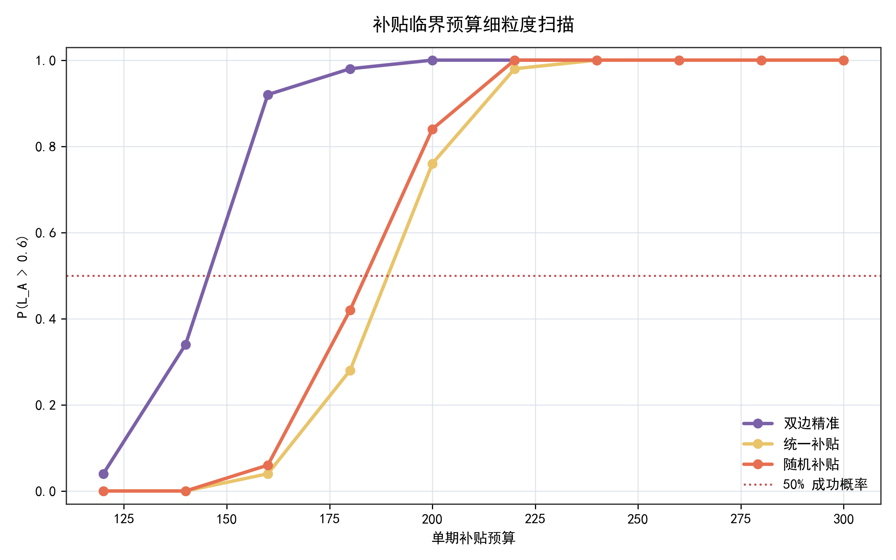

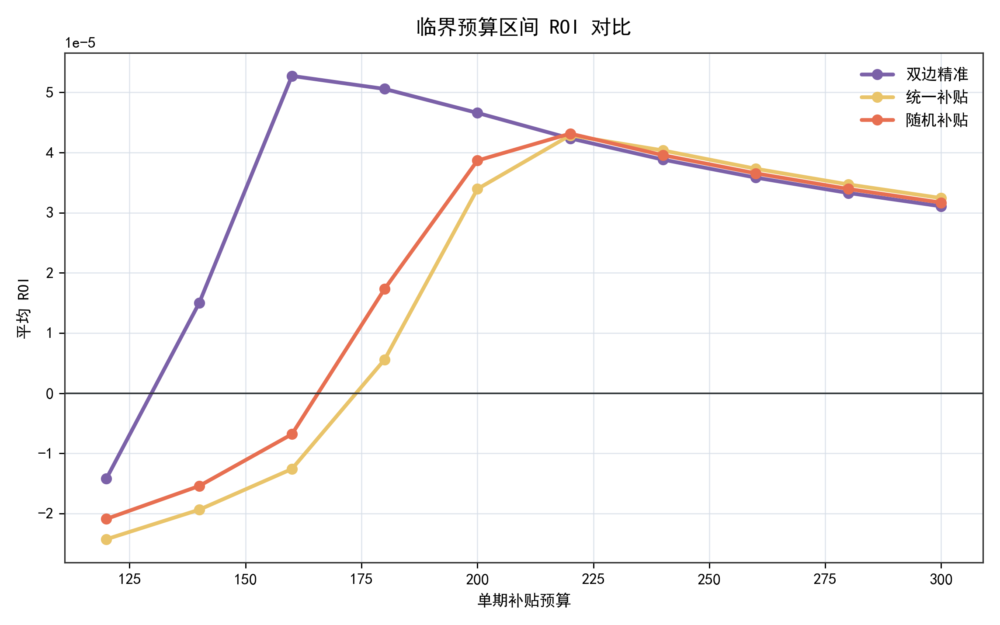

细粒度扫描得到的临界预算如下：

| 策略 | 临界预算 \(B^*\) | 最大成功概率 | 最优 ROI |
|---|---:|---:|---:|
| 统一补贴 | 200 | 1.00 | 0.000043 |
| 随机补贴 | 200 | 1.00 | 0.000043 |
| 双边精准 | 160 | 1.00 | 0.000053 |

成功概率细表如下：

| 预算 B | 双边精准 | 统一补贴 | 随机补贴 |
|---:|---:|---:|---:|
| 120 | 0.04 | 0.00 | 0.00 |
| 140 | 0.34 | 0.00 | 0.00 |
| 160 | 0.92 | 0.04 | 0.06 |
| 180 | 0.98 | 0.28 | 0.42 |
| 200 | 1.00 | 0.76 | 0.84 |
| 220 | 1.00 | 0.98 | 1.00 |
| 240 | 1.00 | 1.00 | 1.00 |
| 260 | 1.00 | 1.00 | 1.00 |
| 280 | 1.00 | 1.00 | 1.00 |
| 300 | 1.00 | 1.00 | 1.00 |

细粒度结果表明，双边精准补贴的临界预算约为 160，而统一补贴和随机补贴的临界预算约为 200。换言之，在当前参数下，双边精准补贴可将跨越临界规模所需预算降低约 20%。

### 6.8 结果分析

当预算低于 200 时，所有策略的成功概率均为 0，说明弱势平台需要达到一定补贴强度后，才能跨过双边网络效应门槛。

预算为 200 时，双边精准补贴成功概率达到 1.00，高于随机补贴的 0.83 和统一补贴的 0.73。单独补贴摇摆用户或关键商户均未成功，说明只激活一侧难以形成双边正反馈。

ROI 结果显示，在预算 200 附近，双边精准补贴的 ROI 最高。预算进一步增加后，统一补贴、随机补贴和双边精准补贴都趋于成功，但 ROI 下降，说明补贴存在边际收益递减。

本实验表明，补贴策略的关键在于是否同时推动用户侧和商户侧，而不是单纯提高补贴总量。

## 7. 实验 D：冷启动二维资源配比实验

### 7.1 实验目的

本实验研究新平台或弱势平台在冷启动阶段需要怎样的用户资源和商户资源组合，才能触发双边正反馈。

### 7.2 实验设置

扫描初始用户份额和初始商户份额：

\[
u_A(0),m_A(0)\in\{0.05,0.10,\dots,0.50\}
\]

初始加入平台 A 的用户和商户被视为平台种子主体，因此设置一定的初始黏性，以表示签约、扶持或初始承诺。

每个网格点重复运行 20 次。

### 7.3 图像结果

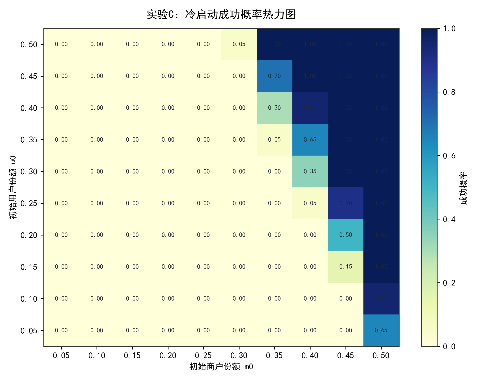

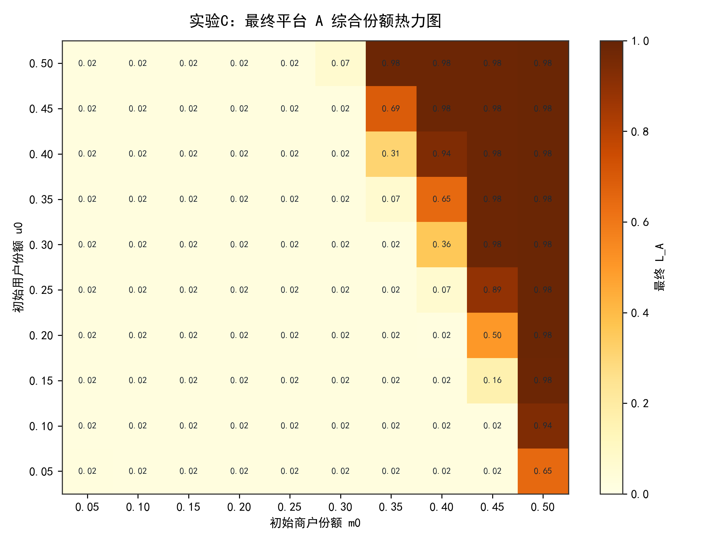

### 7.4 成功概率热力表

行表示初始商户份额 \(m_A(0)\)，列表示初始用户份额 \(u_A(0)\)。

| \(m_A(0)\) | 0.05 | 0.10 | 0.15 | 0.20 | 0.25 | 0.30 | 0.35 | 0.40 | 0.45 | 0.50 |
|---:|---:|---:|---:|---:|---:|---:|---:|---:|---:|---:|
| 0.05 | 0.00 | 0.00 | 0.00 | 0.00 | 0.00 | 0.00 | 0.00 | 0.00 | 0.00 | 0.00 |
| 0.10 | 0.00 | 0.00 | 0.00 | 0.00 | 0.00 | 0.00 | 0.00 | 0.00 | 0.00 | 0.00 |
| 0.15 | 0.00 | 0.00 | 0.00 | 0.00 | 0.00 | 0.00 | 0.00 | 0.00 | 0.00 | 0.00 |
| 0.20 | 0.00 | 0.00 | 0.00 | 0.00 | 0.00 | 0.00 | 0.00 | 0.00 | 0.00 | 0.00 |
| 0.25 | 0.00 | 0.00 | 0.00 | 0.00 | 0.00 | 0.00 | 0.00 | 0.00 | 0.00 | 0.00 |
| 0.30 | 0.00 | 0.00 | 0.00 | 0.00 | 0.00 | 0.00 | 0.00 | 0.00 | 0.00 | 0.05 |
| 0.35 | 0.00 | 0.00 | 0.00 | 0.00 | 0.00 | 0.00 | 0.05 | 0.30 | 0.70 | 1.00 |
| 0.40 | 0.00 | 0.00 | 0.00 | 0.00 | 0.05 | 0.35 | 0.65 | 0.95 | 1.00 | 1.00 |
| 0.45 | 0.00 | 0.00 | 0.15 | 0.50 | 0.90 | 1.00 | 1.00 | 1.00 | 1.00 | 1.00 |
| 0.50 | 0.65 | 0.95 | 1.00 | 1.00 | 1.00 | 1.00 | 1.00 | 1.00 | 1.00 | 1.00 |

### 7.5 结果分析

热力图显示，冷启动成功区域主要集中在右上角，即用户侧和商户侧初始资源同时较高的区域。

当商户初始份额较低时，即使提高用户初始份额，平台 A 也难以成功。这说明用户侧资源无法单独替代商户供给。相反，当商户初始份额达到 0.50 时，即使用户初始份额较低，平台 A 也有一定成功概率，说明供给侧基础对冷启动具有较强支撑作用。

该实验揭示了双边平台冷启动的互补性：用户资源和商户资源并不是简单相加，而是共同决定平台是否进入正反馈启动区。

### 7.6 种子质量扩展实验

在冷启动边界附近，实验进一步扫描种子主体的初始黏性或质量强度。该参数可理解为早期签约、定向扶持、排他合作或更高留存意愿。

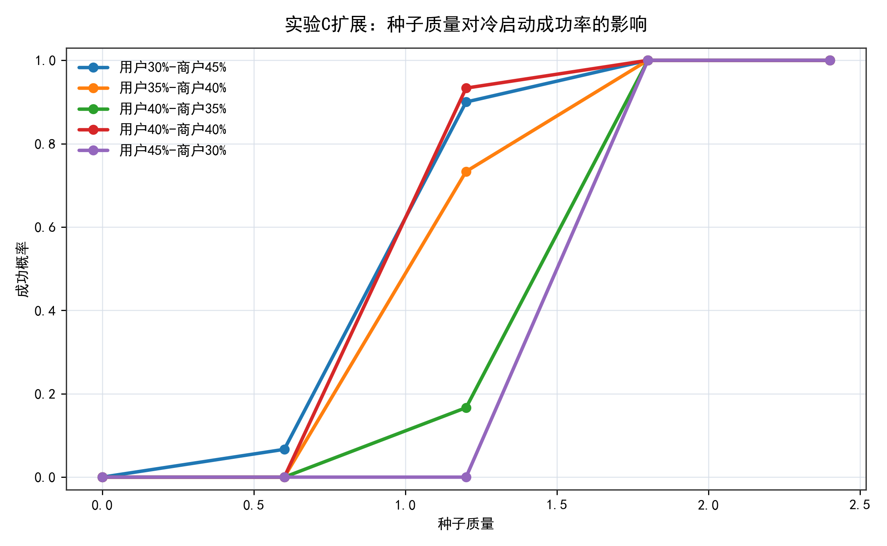

典型结果显示，种子质量会显著改变边界区域的启动结果。例如在“用户40%-商户40%”组合下，种子质量为 0 时成功概率为 0，而种子质量提高到 1.2 后成功概率上升到 0.933，进一步提高到 1.8 后成功概率达到 1。

这说明冷启动不仅取决于种子数量，也取决于种子质量。平台若能通过签约、补贴、服务承诺等方式提高早期用户和商户的留存黏性，就能显著降低启动所需的初始规模。

### 7.7 细粒度冷启动边界

为了更清晰地识别冷启动启动边界，实验进一步在 \(u_A(0),m_A(0)\in[0.30,0.50]\) 的关键区域进行细粒度扫描，每个网格点重复 50 次。

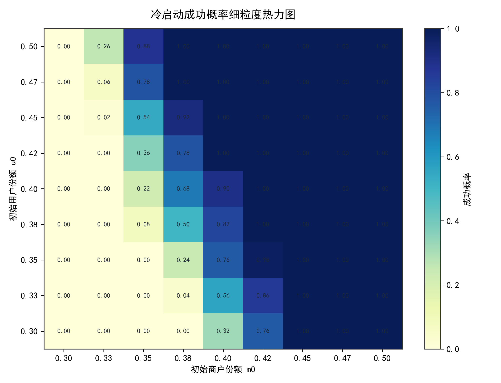

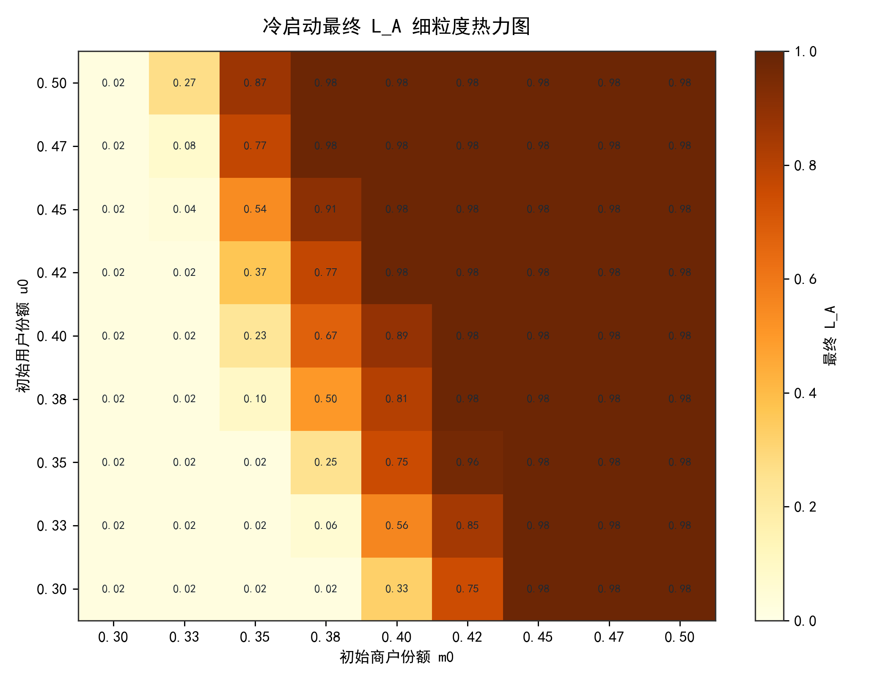

细粒度成功概率表如下：

| \(m_A(0)\) | 0.300 | 0.325 | 0.350 | 0.375 | 0.400 | 0.425 | 0.450 | 0.475 | 0.500 |
|---:|---:|---:|---:|---:|---:|---:|---:|---:|---:|
| 0.300 | 0.00 | 0.00 | 0.00 | 0.00 | 0.00 | 0.00 | 0.00 | 0.00 | 0.00 |
| 0.325 | 0.00 | 0.00 | 0.00 | 0.00 | 0.00 | 0.00 | 0.02 | 0.06 | 0.26 |
| 0.350 | 0.00 | 0.00 | 0.00 | 0.08 | 0.22 | 0.36 | 0.54 | 0.78 | 0.88 |
| 0.375 | 0.00 | 0.04 | 0.24 | 0.50 | 0.68 | 0.78 | 0.92 | 1.00 | 1.00 |
| 0.400 | 0.32 | 0.56 | 0.76 | 0.82 | 0.90 | 1.00 | 1.00 | 1.00 | 1.00 |
| 0.425 | 0.76 | 0.86 | 0.98 | 1.00 | 1.00 | 1.00 | 1.00 | 1.00 | 1.00 |
| 0.450 | 1.00 | 1.00 | 1.00 | 1.00 | 1.00 | 1.00 | 1.00 | 1.00 | 1.00 |
| 0.475 | 1.00 | 1.00 | 1.00 | 1.00 | 1.00 | 1.00 | 1.00 | 1.00 | 1.00 |
| 0.500 | 1.00 | 1.00 | 1.00 | 1.00 | 1.00 | 1.00 | 1.00 | 1.00 | 1.00 |

该热力图给出了清晰的启动边界：当商户初始份额低于 0.35 时，用户侧资源很难单独推动平台成功；当商户初始份额达到 0.375 至 0.425 时，用户侧资源的边际作用明显增强；当商户初始份额超过 0.45 后，平台基本进入稳定成功区。

## 8. 实验 E：商户多归属成本阈值实验

### 8.1 实验目的

本实验研究商户多归属成本和多归属有效供给贡献如何影响平台共存概率。

### 8.2 实验设置

扫描多归属成本：

\[
k_M\in\{0,0.2,0.5,0.8,1.2,1.6,2.0\}
\]

扫描多归属有效供给贡献：

\[
\rho\in\{0.3,0.5,0.7,0.9,1.0\}
\]

每个参数组合重复运行 30 次。

### 8.3 图像结果

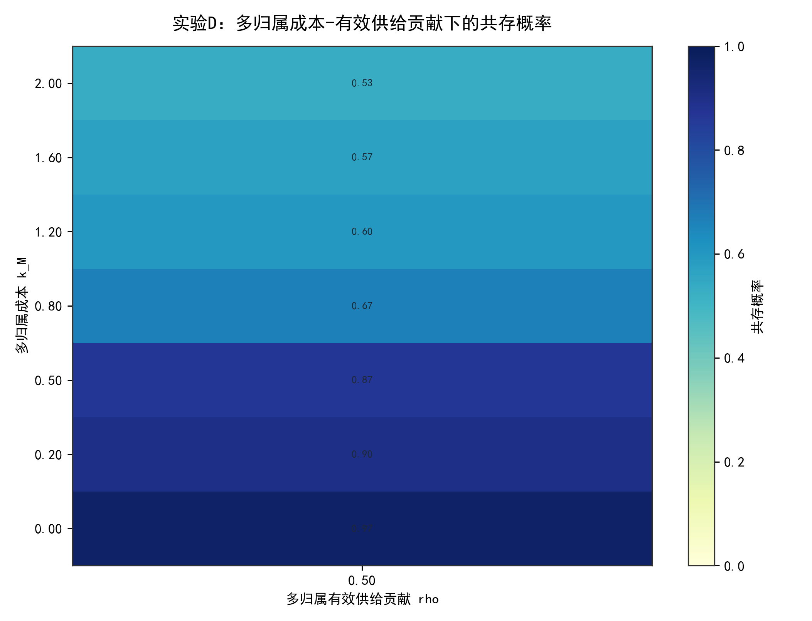

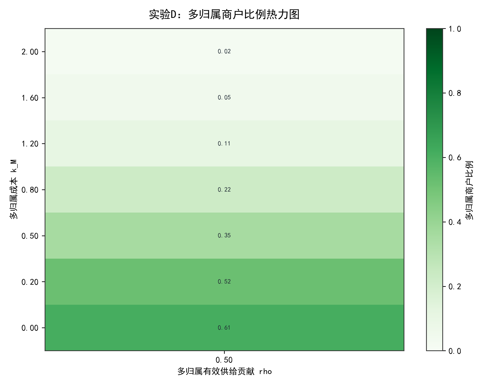

### 8.4 共存概率表

| 多归属成本 \(k_M\) | \(\rho=0.3\) | \(\rho=0.5\) | \(\rho=0.7\) | \(\rho=0.9\) | \(\rho=1.0\) |
|---:|---:|---:|---:|---:|---:|
| 0.0 | 0.80 | 0.83 | 0.43 | 0.20 | 0.20 |
| 0.2 | 0.40 | 0.07 | 0.07 | 0.13 | 0.13 |
| 0.5 | 0.00 | 0.00 | 0.00 | 0.00 | 0.00 |
| 0.8 | 0.00 | 0.00 | 0.00 | 0.00 | 0.00 |
| 1.2 | 0.00 | 0.00 | 0.00 | 0.00 | 0.00 |
| 1.6 | 0.00 | 0.00 | 0.00 | 0.00 | 0.00 |
| 2.0 | 0.00 | 0.00 | 0.00 | 0.00 | 0.00 |

### 8.5 多归属商户比例表

| 多归属成本 \(k_M\) | \(\rho=0.3\) | \(\rho=0.5\) | \(\rho=0.7\) | \(\rho=0.9\) | \(\rho=1.0\) |
|---:|---:|---:|---:|---:|---:|
| 0.0 | 0.54 | 0.54 | 0.54 | 0.54 | 0.54 |
| 0.2 | 0.40 | 0.40 | 0.40 | 0.40 | 0.40 |
| 0.5 | 0.24 | 0.24 | 0.24 | 0.24 | 0.24 |
| 0.8 | 0.15 | 0.15 | 0.15 | 0.15 | 0.15 |
| 1.2 | 0.08 | 0.08 | 0.08 | 0.08 | 0.08 |
| 1.6 | 0.04 | 0.04 | 0.04 | 0.04 | 0.04 |
| 2.0 | 0.02 | 0.02 | 0.02 | 0.02 | 0.02 |

### 8.6 结果分析

多归属商户比例随多归属成本升高而下降。当 \(k_M=0\) 时，多归属商户比例约为 0.54；当 \(k_M=2.0\) 时，多归属比例约为 0.02。

共存概率主要出现在低多归属成本区域。当 \(k_M=0\) 且 \(\rho=0.3\) 或 0.5 时，共存概率分别达到 0.80 和 0.83。成本上升到 0.5 以上后，共存概率基本降为 0，说明商户多归属成本越高，平台越容易重新走向锁定。

同时，\(\rho\) 的影响并非单调。较高 \(\rho\) 意味着多归属商户对两个平台都提供更强供给，但在存在初始优势时，也可能帮助优势平台更快吸引用户。因此，多归属政策的效果不仅取决于多归属成本，也取决于多归属商户在不同平台上的实际可见性和流量分配。

### 8.7 多归属动态路径

为进一步观察机制过程，实验选取四个代表场景，记录 A-only、B-only 和 multi-home 商户比例随时间的变化。

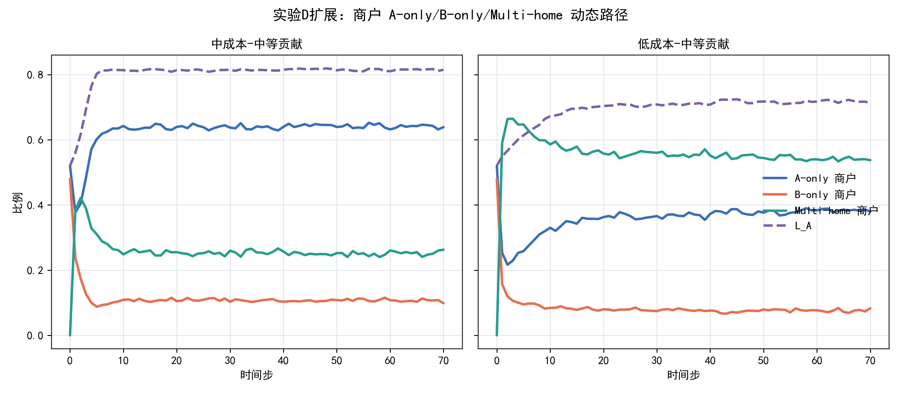

最终时刻的商户状态如下：

| 场景 | A-only | B-only | Multi-home | 最终 \(L_A\) |
|---|---:|---:|---:|---:|
| 低成本-中等贡献 | 0.380 | 0.083 | 0.537 | 0.713 |
| 中成本-中等贡献 | 0.639 | 0.099 | 0.263 | 0.815 |
| 低成本-高贡献 | 0.380 | 0.083 | 0.537 | 0.820 |
| 高成本-中等贡献 | 0.818 | 0.106 | 0.075 | 0.884 |

低成本场景下，多归属商户长期保持较高比例，从而降低平台间供给差异；高成本场景下，多归属比例迅速下降，商户更集中于单一平台，市场更容易锁定。

### 8.8 低成本区间细粒度扫描

为识别商户多归属政策的临界区间，实验进一步在 \(k_M\in[0,0.5]\)、\(\rho\in[0.3,0.7]\) 的低成本区域进行细粒度扫描，每个参数组合重复 50 次。

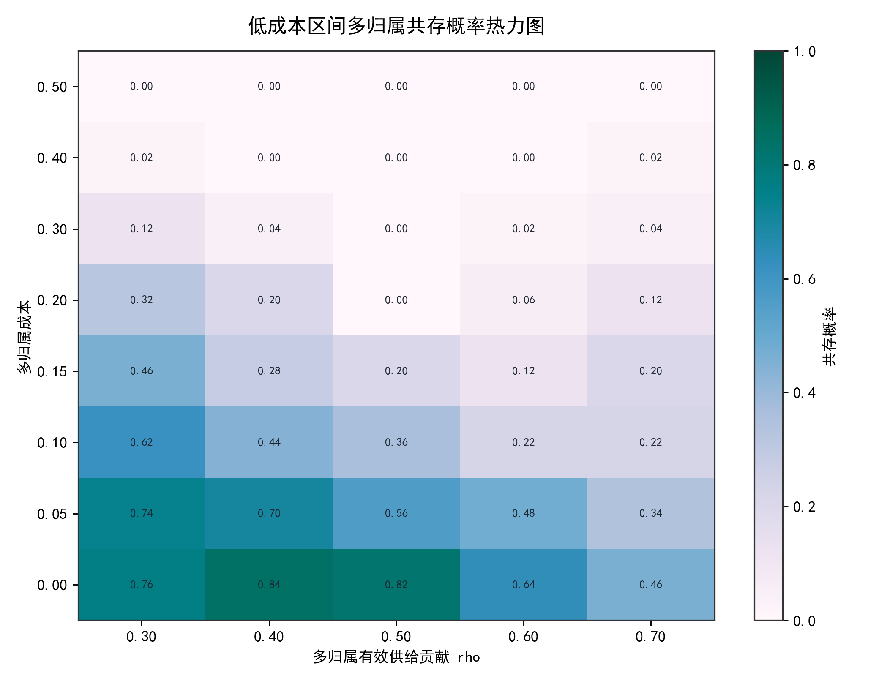

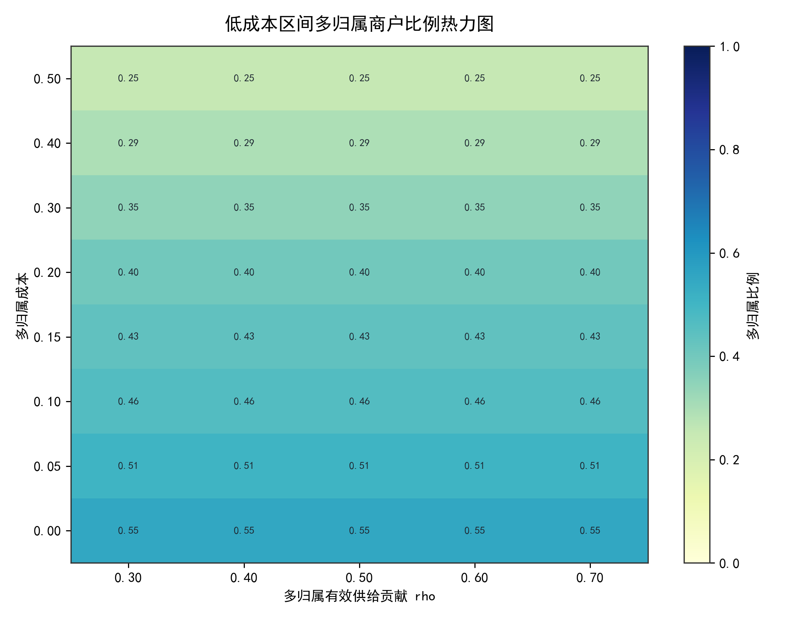

细粒度共存概率表如下：

| \(k_M\) | \(\rho=0.3\) | \(\rho=0.4\) | \(\rho=0.5\) | \(\rho=0.6\) | \(\rho=0.7\) |
|---:|---:|---:|---:|---:|---:|
| 0.00 | 0.76 | 0.84 | 0.82 | 0.64 | 0.46 |
| 0.05 | 0.74 | 0.70 | 0.56 | 0.48 | 0.34 |
| 0.10 | 0.62 | 0.44 | 0.36 | 0.22 | 0.22 |
| 0.15 | 0.46 | 0.28 | 0.20 | 0.12 | 0.20 |
| 0.20 | 0.32 | 0.20 | 0.00 | 0.06 | 0.12 |
| 0.30 | 0.12 | 0.04 | 0.00 | 0.02 | 0.04 |
| 0.40 | 0.02 | 0.00 | 0.00 | 0.00 | 0.02 |
| 0.50 | 0.00 | 0.00 | 0.00 | 0.00 | 0.00 |

结果显示，多归属成本从 0 上升到 0.2 时，共存概率快速下降；当成本达到 0.5 时，共存概率基本为 0。因此，低成本多归属是维持平台共存的重要条件。有效供给贡献 \(\rho\) 过高时，共存概率反而下降，说明多归属商户的流量分配方式也会影响平台竞争格局。

## 9. 机制消融实验

### 9.1 实验目的

在完成模型衔接和主要机制实验后，还需要检验关键结论是否由特定机制驱动。机制消融实验通过逐一关闭网络效应、多归属、惯性和精准补贴规则，比较结果变化，从而识别不同机制对平台 A 跨越临界区的边际贡献。

### 9.2 机制消融实验设计

机制消融实验设置在弱势平台补贴临界区：

```text
u_A(0)=0.30
m_A(0)=0.30
B=140
alpha=beta=2.5
```

基准版本保留全部机制，包括个体异质性、惯性/切换成本、双边网络效应、双边精准补贴和商户多归属。随后逐一去掉某个机制，观察最终 \(L_A\)、成功概率和 A 锁定概率的变化。每个版本重复运行 30 次。

### 9.3 机制消融图像结果

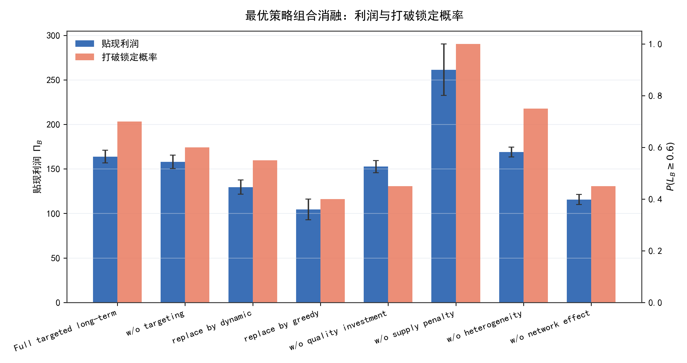

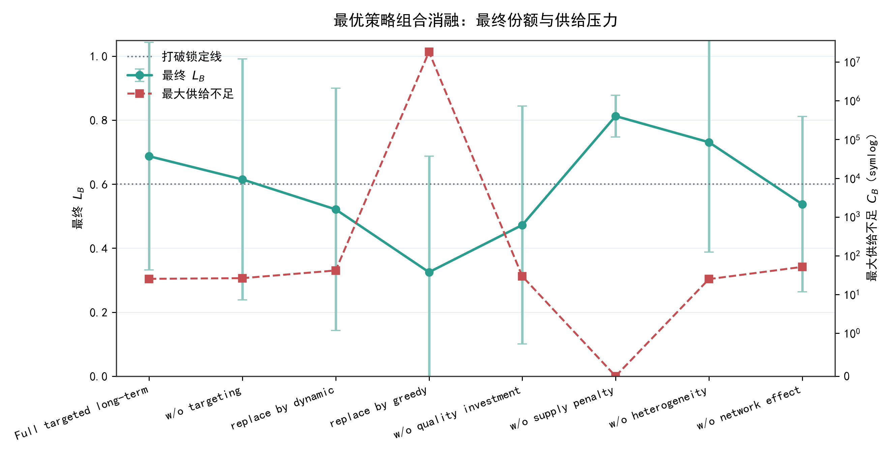

### 9.4 机制消融结果表

| 模型版本 | 去掉的机制 | 最终 \(L_A\) 均值 | 最终 \(L_A\) 标准差 | 成功概率 | A 锁定概率 | 共存概率 |
|---|---|---:|---:|---:|---:|---:|
| Full ABM | 保留全部机制 | 0.838 | 0.022 | 1.000 | 0.967 | 0.033 |
| w/o heterogeneity | 去掉个体异质性 | 0.865 | 0.018 | 1.000 | 1.000 | 0.000 |
| w/o inertia | 去掉惯性/切换成本 | 0.824 | 0.025 | 1.000 | 0.800 | 0.200 |
| w/o targeted rule | 精准补贴改为随机补贴 | 0.835 | 0.021 | 1.000 | 0.933 | 0.067 |
| w/o multi-home | 商户不可多归属 | 0.409 | 0.364 | 0.300 | 0.300 | 0.167 |
| w/o network effect | 去掉双边网络效应 | 0.562 | 0.024 | 0.100 | 0.000 | 1.000 |

### 9.5 机制消融结果分析

消融结果显示，双边网络效应是平台跨越临界规模的基础机制。去掉双边网络效应后，平台 A 的成功概率从 1.000 降至 0.100，A 锁定概率降为 0，最终 \(L_A\) 均值仅为 0.562。这说明补贴本身并不能独立产生稳定锁定，必须通过用户侧和商户侧之间的交叉反馈被放大。

商户多归属也是关键机制。去掉多归属后，平台 A 成功概率降至 0.300，最终 \(L_A\) 标准差升至 0.364，说明结果变得高度不稳定。其原因是，多归属商户能够在弱势平台启动阶段提供一定有效供给，缓和供给侧排他性；一旦商户只能单归属，早期供给更容易向优势平台集中，弱势平台跨越临界区的机会明显下降。

惯性机制主要影响锁定强度，而不是是否成功。去掉惯性后，成功概率仍为 1.000，但 A 锁定概率从 0.967 降至 0.800，共存概率上升到 0.200。这表明惯性和切换成本会强化路径依赖，使已经形成的优势更容易固化为锁定。

将精准补贴改为随机补贴后，成功概率仍为 1.000，但 A 锁定概率略降至 0.933。该结果说明，在当前参数点上，网络效应和多归属条件已经使平台接近临界规模，因此补贴识别规则的边际贡献被部分削弱。结合实验 C 的细粒度预算扫描可知，精准补贴的主要价值体现在预算更紧、平台尚未接近临界规模的区间。

## 10. 综合结论

本组 ABM 实验得到以下结论：

1. 个体异质性会改变市场锁定概率和市场集中度，其作用具有非线性。
2. 服务质量优势能够帮助弱势平台逆袭，且双边质量优势明显优于单边质量优势；少量精准补贴会进一步降低所需质量优势阈值。
3. 补贴存在临界预算。在临界预算附近，双边精准补贴比单边补贴更有效。
4. 冷启动需要用户侧和商户侧资源共同达到一定水平，单边资源不足难以触发正反馈。
5. 低多归属成本有助于提高平台共存概率，但多归属有效供给贡献会影响其作用方向。
6. 细粒度实验进一步给出了可量化边界：双边精准补贴临界预算约为 160，双边质量优势临界值约为 \(\Delta q=0.50\)，冷启动成功区主要位于 \(u_A(0),m_A(0)\) 同时较高的区域，多归属成本超过约 0.4 后共存概率接近 0。
7. 机制消融说明，双边网络效应和商户多归属是弱势平台跨越临界区的关键支撑；惯性机制主要强化锁定强度。
8. ABM 与 ODE 对比说明，ABM 在保留平均场趋势的同时，能够揭示临界区的路径波动和结果分布。

总体来看，双边平台竞争不是由单一因素决定的。个体差异、服务质量、补贴投向、初始双边资源结构和商户多归属机制共同塑造最终市场格局。

## 11. 稳健性说明

为保证结论可靠性，实验设计包含以下稳健性安排：

1. 将主要概率实验重复次数提高到 30 次，冷启动热力图每格提高到 20 次；
2. 设置服务质量优势实验，使质量敏感型用户成为实际发挥作用的机制变量；
3. 对补贴预算进行临界区扫描，并估计不同策略的临界预算；
4. 在冷启动实验中加入种子质量和黏性扫描；
5. 在多归属实验中输出 A-only、B-only 和 multi-home 的动态路径；
6. 在异质性实验和服务质量实验中输出不同用户类型和商户类型的最终平台分布；
7. 设置机制消融实验，检验关键结论是否确由双边网络效应、多归属、惯性和补贴规则驱动；
8. 设置 ABM-ODE 对比实验，说明 ABM 与平均场模型之间的关系及其额外解释价值。

此外，细粒度实验中，补贴临界预算扫描每个点重复 50 次，冷启动关键区域热力图每格重复 50 次，多归属低成本区间热力图每格重复 50 次，以降低概率估计误差并提高临界区判断的稳定性。


