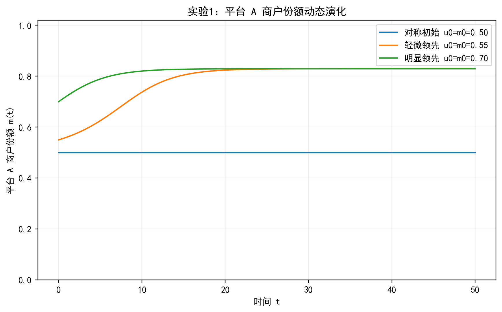
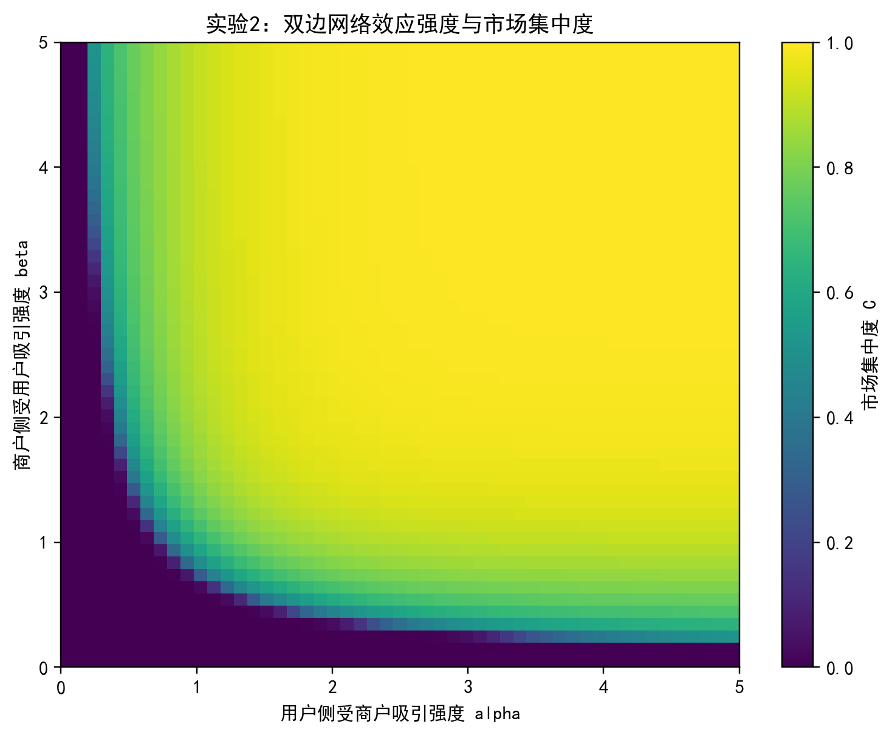
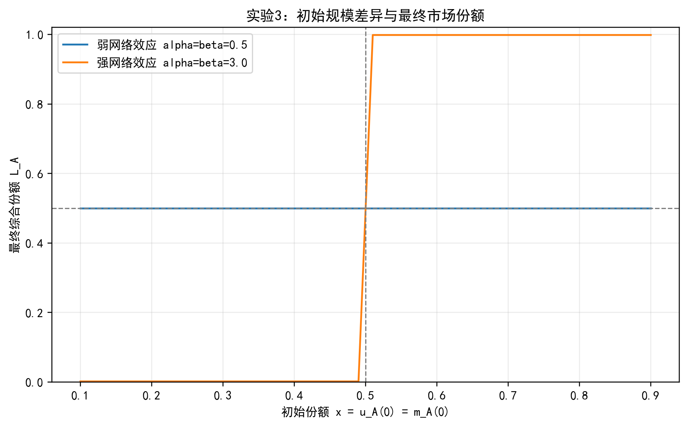
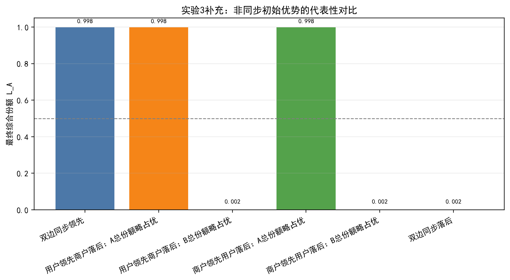
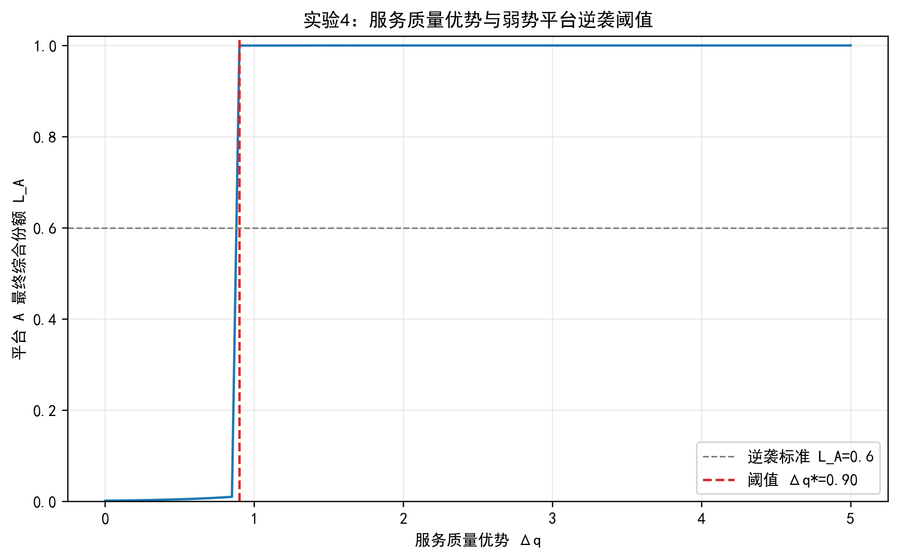
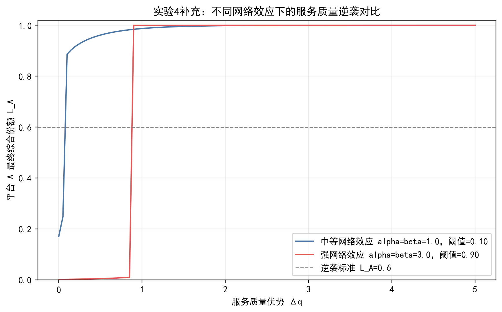
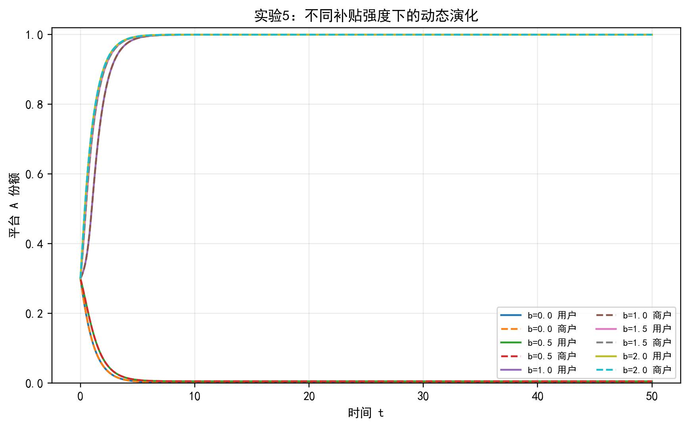
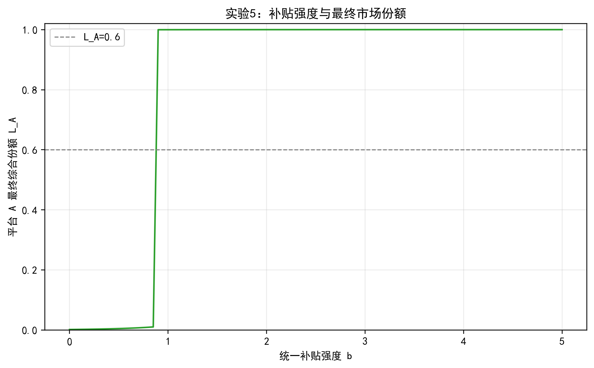
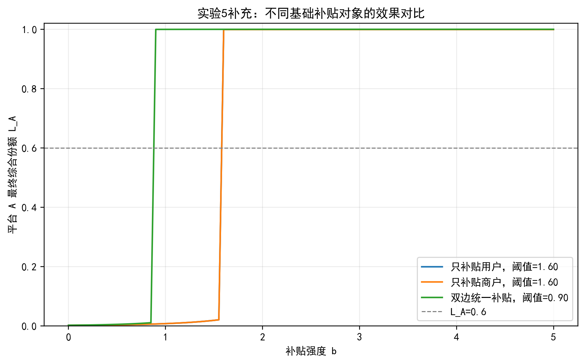

# 阶段一基础实验说明报告

## 1. 实验目的与模型说明

阶段一实验基于“双边平台竞争中的网络效应与市场锁定”主题，采用统一的 Logit 选择 + 动态调整模型，分析两个平台在用户侧和商户侧双边网络效应作用下的市场份额演化。

模型核心状态变量为平台 A 的用户份额 \(u(t)\) 和商户份额 \(m(t)\)。用户和商户根据平台效用进行 Logit 选择，随后市场份额按照“当前选择概率与已有市场份额之间的差距”动态调整：

\[
\frac{du}{dt}=\lambda_U(P_A^U-u),\qquad
\frac{dm}{dt}=\lambda_M(P_A^M-m)
\]

其中，\(\alpha\) 表示商户规模对用户吸引力的影响，\(\beta\) 表示用户规模对商户吸引力的影响，二者共同刻画双边网络效应。阶段一主要完成基础动态演化、网络效应强度、初始规模差异、服务质量差异和补贴策略五组实验。

## 2. 实验 1：基础动态演化实验

### 2.1 实验设置

基础参数设置为：

- \(\alpha=\beta=1.0\)；
- \(s_U=s_M=0.2\)；
- \(\gamma_U=\gamma_M=2.0\)；
- \(\lambda_U=\lambda_M=1.0\)；
- 两个平台服务质量、价格和补贴均相同。

初始条件设置为三组：

| 初始条件 | \(u_A(0)\) | \(m_A(0)\) |
|---|---:|---:|
| 对称初始 | 0.50 | 0.50 |
| 轻微领先 | 0.55 | 0.55 |
| 明显领先 | 0.70 | 0.70 |

### 2.2 结果观察

仿真结果如下：

| 初始条件 | \(u_A(\infty)\) | \(m_A(\infty)\) | 市场集中度 \(C\) | 市场状态 |
|---|---:|---:|---:|---|
| 对称初始 | 0.5000 | 0.5000 | 0.0000 | 双平台共存 |
| 轻微领先 | 0.8293 | 0.8293 | 0.6586 | 市场倾斜 |
| 明显领先 | 0.8293 | 0.8293 | 0.6586 | 市场倾斜 |

图 1 和图 2 分别展示了平台 A 用户份额与商户份额随时间的演化过程。

### 2.3 结果解释

当两个平台完全对称且初始份额均为 0.5 时，系统维持在对称均衡状态，说明模型能够反映双平台共存情形。

当平台 A 具有轻微初始优势时，其用户份额和商户份额均被网络效应进一步放大，最终稳定在约 0.829。说明即使平台之间没有质量、价格和补贴差异，仅初始规模优势也可能通过双边网络效应形成长期市场倾斜。

当初始优势从 0.55 增大到 0.70 时，最终结果并未进一步接近 1，而是收敛到相近的稳定状态。这说明在当前参数下，网络效应足以放大优势，但尚未达到完全赢家通吃的强度。

## 3. 实验 2：双边网络效应强度实验

### 3.1 实验设置

扫描网络效应参数：

\[
\alpha\in[0,5],\qquad \beta\in[0,5]
\]

网格大小为 \(51\times 51\)，初始条件固定为 \(u_A(0)=m_A(0)=0.55\)。市场集中度定义为：

\[
C=|u_A(\infty)-0.5|+|m_A(\infty)-0.5|
\]

分类标准为：

- \(C<0.2\)：双平台共存；
- \(0.2\le C<0.8\)：市场倾斜；
- \(C\ge0.8\)：市场锁定。

### 3.2 结果观察

代表性参数点结果如下：

| \(\alpha\) | \(\beta\) | \(C\) | 市场状态 |
|---:|---:|---:|---|
| 0.0 | 0.0 | 0.0000 | 双平台共存 |
| 0.5 | 0.5 | 0.0000 | 双平台共存 |
| 1.0 | 1.0 | 0.6586 | 市场倾斜 |
| 2.0 | 2.0 | 0.9727 | 市场锁定 |
| 3.0 | 3.0 | 0.9966 | 市场锁定 |
| 5.0 | 5.0 | 0.9999 | 市场锁定 |
| 5.0 | 0.0 | 0.0000 | 双平台共存 |
| 0.0 | 5.0 | 0.0000 | 双平台共存 |
| 2.0 | 4.0 | 0.9875 | 市场锁定 |
| 4.0 | 2.0 | 0.9875 | 市场锁定 |

在全部 2601 个参数组合中：

- 双平台共存区域：361 个；
- 市场倾斜区域：355 个；
- 市场锁定区域：1885 个。

图 3 展示了不同 \(\alpha,\beta\) 组合下的市场集中度热力图。

### 3.3 结果解释

实验结果表明，双边网络效应强度是决定市场结构的关键因素。当 \(\alpha\) 和 \(\beta\) 都较弱时，初始领先难以被持续放大，市场最终趋向共存。当 \(\alpha=\beta=1.0\) 时，市场已经出现明显倾斜；当 \(\alpha=\beta\ge2.0\) 时，平台 A 的轻微初始优势会被迅速放大，市场进入锁定状态。

值得注意的是，当只有一侧网络效应很强、另一侧网络效应为 0 时，例如 \((\alpha,\beta)=(5,0)\) 或 \((0,5)\)，系统仍未形成锁定。这说明赢家通吃并非单侧效应造成，而是用户侧和商户侧之间相互强化的正反馈共同导致。

## 4. 实验 3：初始规模差异实验

### 4.1 实验设置

设置两种网络效应水平：

| 组别 | \(\alpha\) | \(\beta\) |
|---|---:|---:|
| 弱网络效应 | 0.5 | 0.5 |
| 强网络效应 | 3.0 | 3.0 |

扫描初始份额：

\[
u_A(0)=m_A(0)=x,\qquad x\in[0.1,0.9]
\]

记录最终综合份额：

\[
L_A=\frac{u_A(\infty)+m_A(\infty)}{2}
\]

### 4.2 结果观察

部分代表性结果如下：

| 网络效应 | 初始份额 \(x\) | 最终综合份额 \(L_A\) |
|---|---:|---:|
| 弱网络效应 | 0.10 | 0.5000 |
| 弱网络效应 | 0.50 | 0.5000 |
| 弱网络效应 | 0.55 | 0.5000 |
| 弱网络效应 | 0.70 | 0.5000 |
| 弱网络效应 | 0.90 | 0.5000 |
| 强网络效应 | 0.10 | 0.0017 |
| 强网络效应 | 0.50 | 0.5000 |
| 强网络效应 | 0.55 | 0.9983 |
| 强网络效应 | 0.70 | 0.9983 |
| 强网络效应 | 0.90 | 0.9983 |

图 4 展示了初始份额与最终综合份额之间的关系。

为了进一步体现双边平台的结构特征，在不进行完整二维临界区域扫描的前提下，补充设置了若干组非同步初始优势情形，即用户侧和商户侧的初始份额不再完全相等。由于模型只显式记录平台 A 的份额，平台 B 的初始份额由补集给出，即 \(u_B(0)=1-u_A(0)\)、\(m_B(0)=1-m_A(0)\)。强网络效应下的代表性结果如下：

| 初始情形 | \(u_A(0)\) | \(m_A(0)\) | \(u_A(\infty)\) | \(m_A(\infty)\) | \(L_A\) | 市场状态 |
|---|---:|---:|---:|---:|---:|---|
| 双边同步领先 | 0.60 | 0.60 | 0.9983 | 0.9983 | 0.9983 | 平台A锁定 |
| 用户领先商户落后：A总份额略占优 | 0.7001 | 0.3001 | 0.9983 | 0.9983 | 0.9983 | 平台A锁定 |
| 用户领先商户落后：B总份额略占优 | 0.6999 | 0.2999 | 0.0017 | 0.0017 | 0.0017 | 平台B锁定 |
| 商户领先用户落后：A总份额略占优 | 0.3001 | 0.7001 | 0.9983 | 0.9983 | 0.9983 | 平台A锁定 |
| 商户领先用户落后：B总份额略占优 | 0.2999 | 0.6999 | 0.0017 | 0.0017 | 0.0017 | 平台B锁定 |
| 双边同步落后 | 0.40 | 0.40 | 0.0017 | 0.0017 | 0.0017 | 平台B锁定 |

图 5 展示了上述非同步初始条件下的最终综合份额对比。

### 4.3 结果解释

弱网络效应下，不同初始份额最终均回到 0.5 附近，说明市场具有较强的自我均衡能力，早期优势不会被持续放大。

强网络效应下，系统表现出明显路径依赖：当初始份额低于 0.5 时，平台 A 几乎完全失败；当初始份额略高于 0.5，例如 0.55 时，平台 A 最终接近完全锁定。这说明强双边网络效应会把早期微小差异转化为长期市场结构差异。

补充实验进一步表明，交叉优势情形具有很强的边界敏感性。这里的“交叉优势”是指平台 A 在一侧领先、另一侧落后。例如 \((u_A(0),m_A(0))=(0.7,0.3)\) 表示平台 A 用户侧明显领先、商户侧明显落后；由于平台 B 的份额是 A 的补集，因此平台 B 此时为 \((u_B(0),m_B(0))=(0.3,0.7)\)，即用户侧明显落后、商户侧明显领先。

需要注意的是，\((0.7,0.3)\) 这类点并不表示平台 A 或平台 B 在总体规模上更大。因为：

\[
u_A(0)+m_A(0)=0.7+0.3=1.0
\]

\[
u_B(0)+m_B(0)=0.3+0.7=1.0
\]

也就是说，平台 A 和平台 B 的两侧初始规模总和完全相同，只是优势分布在不同侧。因此在完全对称参数下，这类点接近分界状态，不能简单判断“一定是 A 锁定”或“一定是 B 锁定”。

为了说明这种分界状态，实验在 \((0.7,0.3)\) 附近加入极小变化，也就是“微小扰动”。例如：

\[
(0.7,0.3)\rightarrow(0.7001,0.3001)
\]

此时平台 A 两侧初始份额之和为 \(1.0002\)，平台 B 两侧初始份额之和为 \(0.9998\)，A 只比 B 多出极小优势，最终却走向平台 A 锁定。相反：

\[
(0.7,0.3)\rightarrow(0.6999,0.2999)
\]

此时平台 A 两侧初始份额之和为 \(0.9998\)，平台 B 两侧初始份额之和为 \(1.0002\)，B 只比 A 多出极小优势，最终走向平台 B 锁定。

因此，“微小扰动”的含义是：在临界点附近，对初始份额做非常小的改变，观察系统最终会被网络效应放大到哪个方向。该结果说明双边平台的早期竞争不仅取决于某一侧是否领先，还取决于两侧优势合在一起是否形成整体上的正反馈。

## 5. 实验 4：服务质量差异实验

### 5.1 实验设置

设平台 A 初始处于弱势：

\[
u_A(0)=m_A(0)=0.3
\]

平台 A 具有服务质量优势：

\[
q_A^U=q_A^M=\Delta q,\qquad q_B^U=q_B^M=0
\]

扫描：

\[
\Delta q\in[0,5]
\]

逆袭成功标准设为：

\[
L_A>0.6
\]

### 5.2 结果观察

实验发现，平台 A 逆袭所需的最小服务质量优势约为：

\[
\Delta q^*=0.90
\]

当 \(\Delta q=0.90\) 时：

| \(\Delta q\) | \(u_A(\infty)\) | \(m_A(\infty)\) | \(L_A\) |
|---:|---:|---:|---:|
| 0.90 | 0.9997 | 0.9997 | 0.9997 |

图 6 展示了服务质量优势 \(\Delta q\) 对平台 A 最终综合份额的影响，并标出了逆袭阈值。

为了比较网络效应强弱对质量逆袭难度的影响，补充设置了中等网络效应 \(\alpha=\beta=1.0\) 和强网络效应 \(\alpha=\beta=3.0\) 两种情形。代表性结果如下：

| 网络效应 | \(\Delta q\) | \(u_A(\infty)\) | \(m_A(\infty)\) | \(L_A\) | 是否逆袭 |
|---|---:|---:|---:|---:|---|
| 中等网络效应 | 0.00 | 0.1707 | 0.1707 | 0.1707 | 否 |
| 中等网络效应 | 0.10 | 0.8864 | 0.8864 | 0.8864 | 是 |
| 强网络效应 | 0.00 | 0.0017 | 0.0017 | 0.0017 | 否 |
| 强网络效应 | 0.10 | 0.0021 | 0.0021 | 0.0021 | 否 |
| 强网络效应 | 0.90 | 0.9997 | 0.9997 | 0.9997 | 是 |

图 7 展示了两种网络效应强度下服务质量优势与最终综合份额的关系。

### 5.3 结果解释

服务质量提升可以帮助弱势平台改善吸引力，但在强网络效应下，小幅质量优势不足以改变市场格局。只有当质量优势超过临界阈值后，平台 A 才能跨过网络效应形成的锁定屏障，并迅速从弱势状态转为优势状态。

该结果说明后发平台不能仅依靠微弱改进参与竞争，而需要形成足够显著的差异化优势。服务质量优势一旦超过临界点，双边网络效应会反过来帮助弱势平台加速扩张。

补充对比说明，网络效应越强，弱势平台对服务质量优势的要求越高。在中等网络效应下，\(\Delta q=0.10\) 已能使平台 A 的最终综合份额达到 0.8864；但在强网络效应下，同样的质量优势几乎不能改变弱势地位，必须达到约 \(\Delta q=0.90\) 才能完成逆袭。

## 6. 实验 5：补贴策略基础实验

### 6.1 实验设置

平台 A 初始处于弱势：

\[
u_A(0)=m_A(0)=0.3
\]

平台 A 对用户和商户提供统一补贴：

\[
b_A^U=b_A^M=b
\]

平台 B 不补贴，扫描：

\[
b\in[0,5]
\]

### 6.2 结果观察

实验发现，平台 A 通过补贴实现突破的阈值约为：

\[
b^*=0.90
\]

无补贴与高补贴的对比结果如下：

| 补贴强度 \(b\) | \(u_A(\infty)\) | \(m_A(\infty)\) | \(L_A\) | 市场状态 |
|---:|---:|---:|---:|---|
| 0.00 | 0.0017 | 0.0017 | 0.0017 | 市场锁定 |
| 0.90 | 0.9997 | 0.9997 | 0.9997 | 市场锁定 |
| 5.00 | 1.0000 | 1.0000 | 1.0000 | 市场锁定 |

图 8 展示了不同补贴强度下平台 A 用户份额和商户份额的动态演化，图 9 展示了统一补贴强度与最终综合份额之间的关系。

为避免阶段一补贴实验过于单一，同时不进入阶段二的“固定预算最优分配”问题，补充比较三种基础补贴对象：

| 补贴策略 | 突破阈值 | 阈值处 \(u_A(\infty)\) | 阈值处 \(m_A(\infty)\) | 阈值处 \(L_A\) |
|---|---:|---:|---:|---:|
| 只补贴用户 | \(b=1.60\) | 0.9999 | 0.9983 | 0.9991 |
| 只补贴商户 | \(b=1.60\) | 0.9983 | 0.9999 | 0.9991 |
| 双边统一补贴 | \(b=0.90\) | 0.9997 | 0.9997 | 0.9997 |

当 \(b=0.90\) 时，单边补贴仍无法逆袭：只补贴用户时 \(L_A=0.0061\)，只补贴商户时 \(L_A=0.0061\)；而双边统一补贴已经能够使 \(L_A\) 达到 0.9997。

图 10 展示了三种基础补贴对象下的最终综合份额对比。

### 6.3 结果解释

在无补贴情况下，平台 A 由于初始份额较低，会被平台 B 的规模优势压制，最终几乎退出市场。随着补贴强度提高，平台 A 的吸引力上升。当补贴达到约 0.90 时，平台 A 能够突破临界规模，并借助双边网络效应形成快速扩张。

该结果并不意味着补贴越高越好。当前实验只考察市场份额，没有纳入补贴成本和平台利润。高补贴虽然能够带来更高份额，但如果考虑成本，最优补贴应是能够帮助平台跨过临界规模且不过度消耗利润的补贴水平。

补充实验还表明，在双边平台竞争中，双边补贴比单边补贴更容易触发正反馈。单边补贴虽然可以优先改善一侧吸引力，但另一侧规模不足会限制反馈链条的形成；双边补贴同时改善用户侧和商户侧吸引力，因此在较低补贴强度下就能跨过临界规模。

## 7. 阶段一总体结论

阶段一实验表明，双边平台竞争具有明显的非线性和路径依赖特征。主要结论如下：

1. 在完全对称条件下，两个平台可以维持共存；但只要一方具有初始规模优势，网络效应就可能放大这一优势。
2. 市场锁定主要来自用户侧和商户侧网络效应的相互强化。单侧网络效应很强时不一定导致赢家通吃，双边正反馈共同存在时锁定风险显著增加。
3. 初始规模差异在弱网络效应下影响有限，但在强网络效应下会被急剧放大，形成明显的路径依赖。
4. 初始优势需要在用户侧和商户侧协调存在。单边初始领先若缺乏另一侧支持，仍可能无法形成正反馈。
5. 弱势平台可以通过服务质量提升实现逆袭，但必须超过一定临界阈值。本实验中强网络效应下逆袭阈值约为 \(\Delta q^*=0.90\)；中等网络效应下所需质量优势明显更低。
6. 补贴也可以帮助弱势平台突破锁定。本实验中双边统一补贴阈值约为 \(b^*=0.90\)，而只补贴用户或只补贴商户的突破阈值约为 \(b=1.60\)。这说明基础阶段中，双边补贴比单边补贴更容易形成网络正反馈。

因此，阶段一实验验证了基础模型的合理性，并初步回答了平台共存、市场倾斜和市场锁定的形成机制。后续阶段可以在此基础上进一步研究临界区域、补贴分配、补贴退出、利润约束和机器学习预测等问题。
