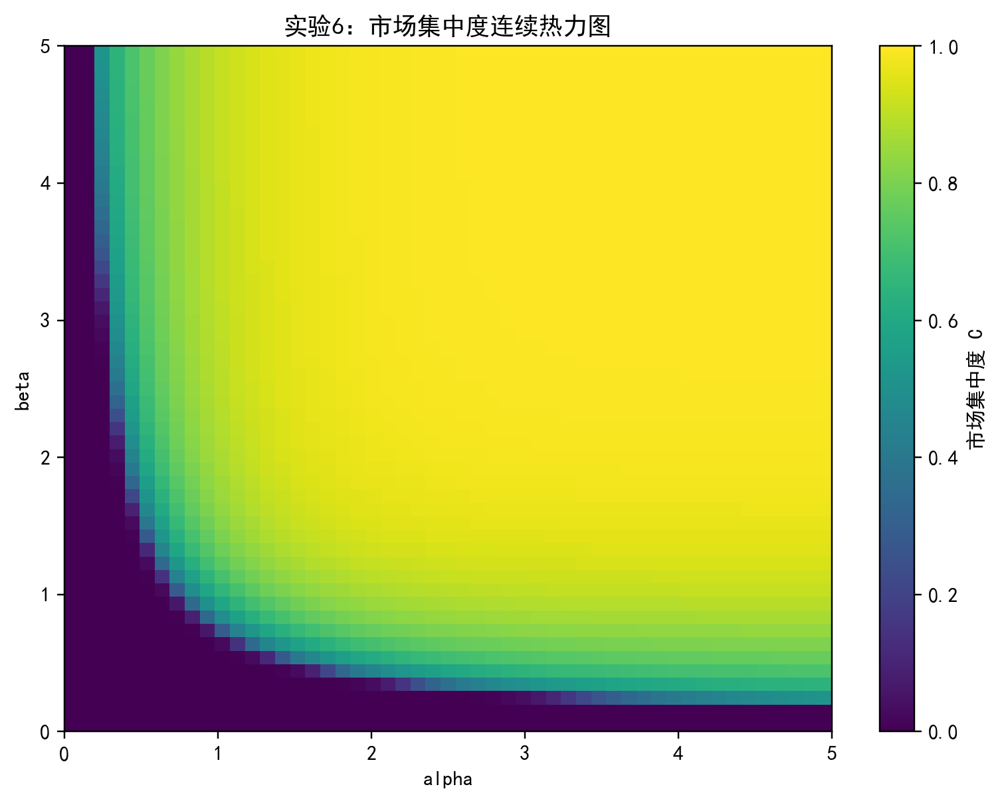
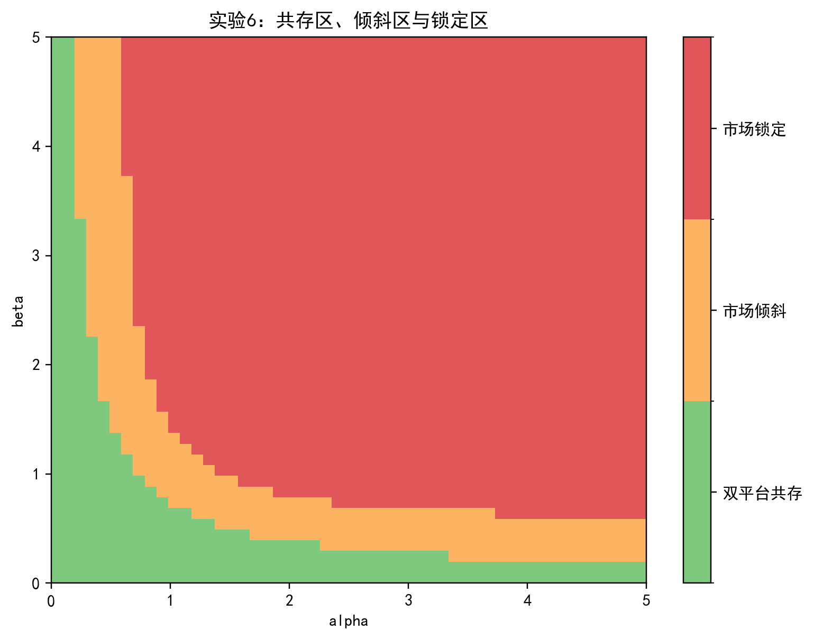
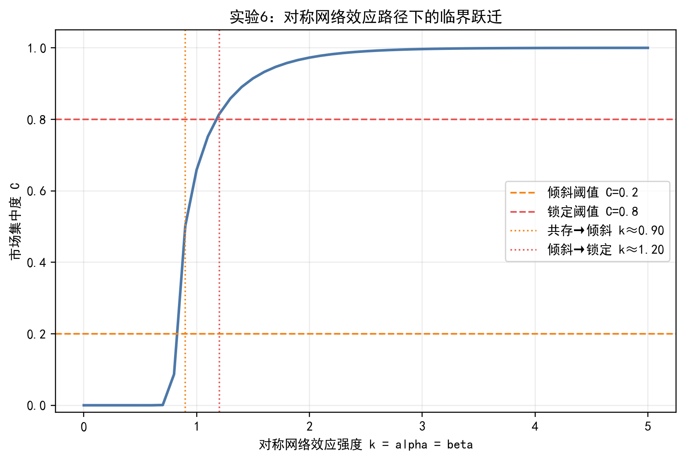
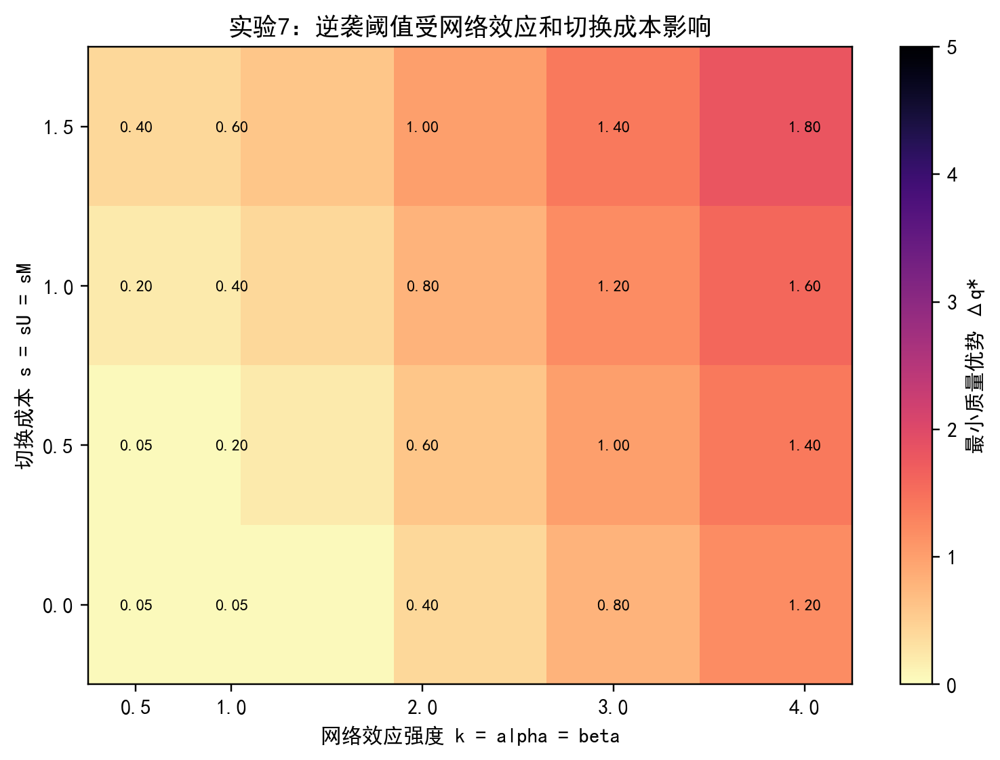
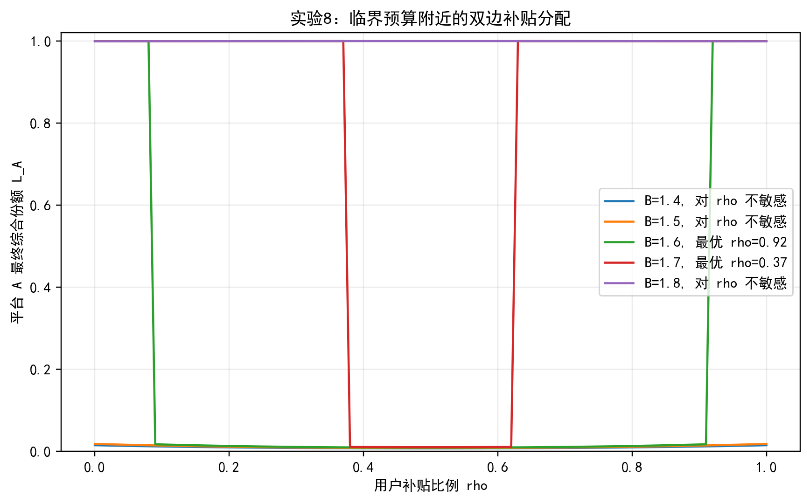
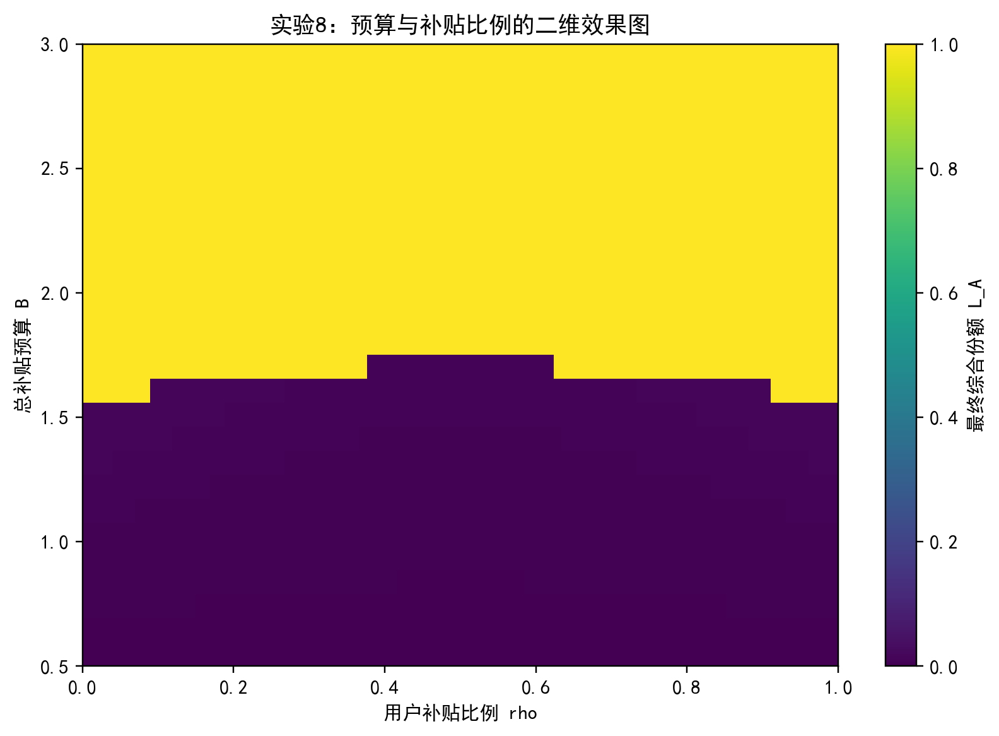
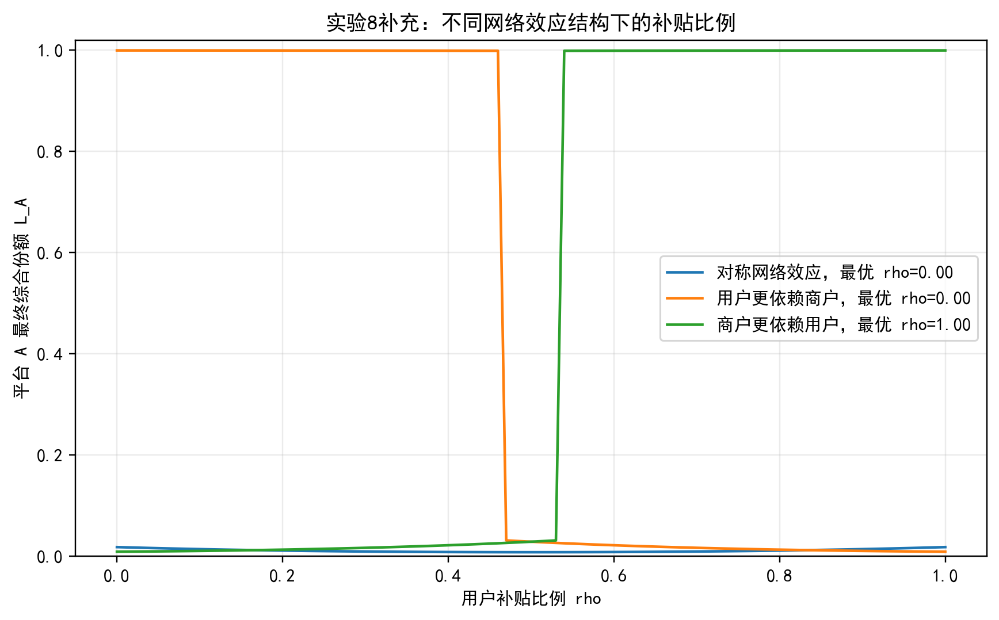
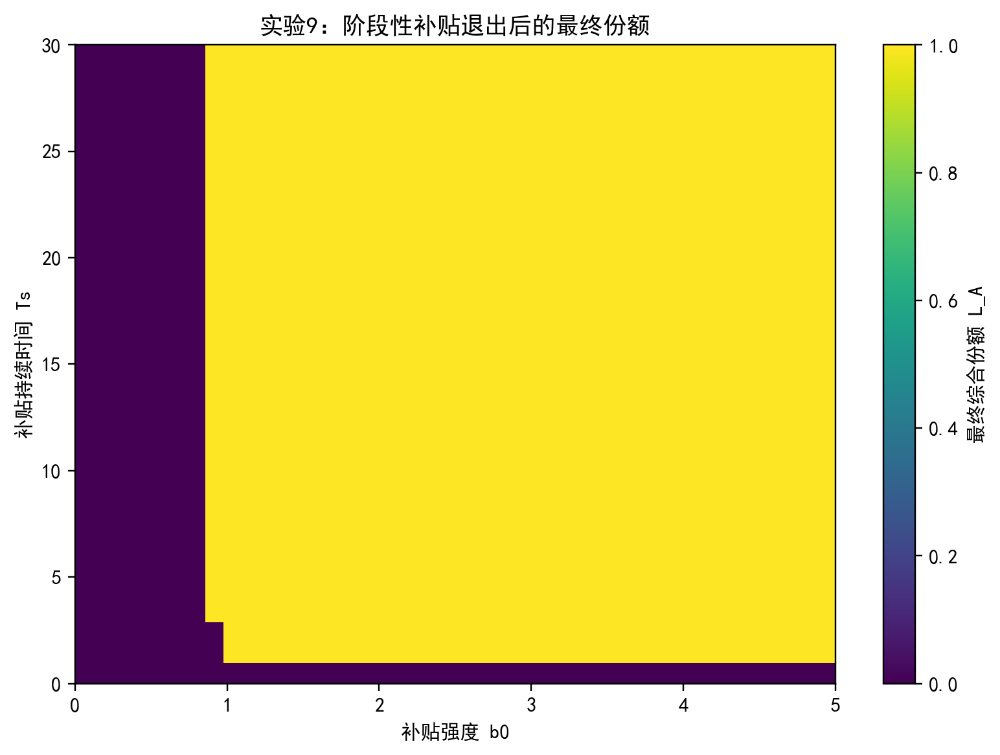
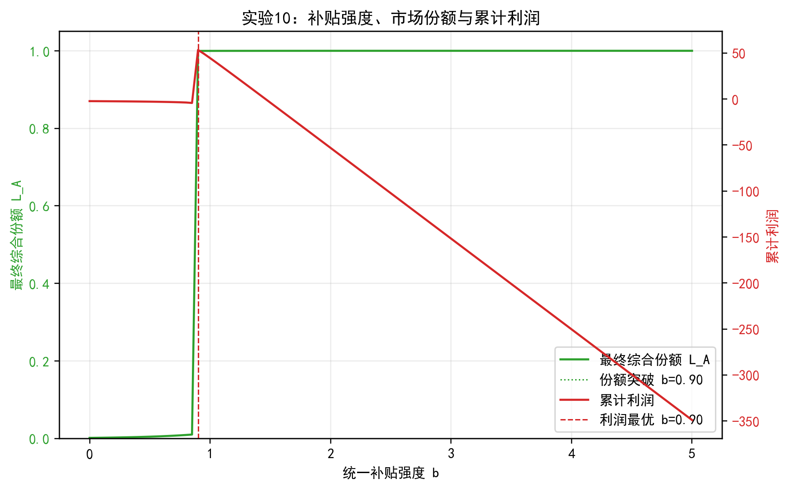

# 阶段二提高型实验说明报告

## 1. 阶段二实验目标

阶段二在阶段一 Logit 选择 + 动态调整模型的基础上，进一步研究市场锁定的临界区域、弱势平台逆袭门槛、补贴分配方式、补贴退出条件以及利润约束。相比阶段一的基础机制验证，阶段二更关注“临界条件”和“策略选择”。

本阶段继续使用平台 A 的用户份额 \(u_A(t)\) 和商户份额 \(m_A(t)\) 作为状态变量，平台 B 的份额由补集给出：

\[
u_B(t)=1-u_A(t),\qquad m_B(t)=1-m_A(t)
\]

市场集中度仍定义为：

\[
C=|u_A(\infty)-0.5|+|m_A(\infty)-0.5|
\]

分类标准为：

| 市场状态 | 判定条件 |
|---|---|
| 双平台共存 | \(C<0.2\) |
| 市场倾斜 | \(0.2\le C<0.8\) |
| 市场锁定 | \(C\ge0.8\) |

其中，若 \(u_A(\infty),m_A(\infty)>0.8\)，则表示平台 A 锁定；若 \(u_A(\infty),m_A(\infty)<0.2\)，则表示平台 B 锁定。

## 2. 实验 6：市场锁定临界区域实验

### 2.1 实验设置

实验 6 在阶段一实验 2 的基础上进一步划分市场状态区域。二者的侧重点不同：阶段一实验 2 是“机制展示”，主要说明市场集中度 \(C\) 会随着 \(\alpha,\beta\) 增强而上升；阶段二实验 6 是“区域识别”，重点是把连续的 \(C\) 转换为共存、倾斜、锁定三类区域，并进一步给出沿 \(\alpha=\beta=k\) 路径的临界阈值。

本实验扫描参数：

\[
\alpha\in[0,5],\qquad \beta\in[0,5]
\]

网格大小为 \(51\times 51\)，初始条件固定为：

\[
u_A(0)=m_A(0)=0.55
\]

### 2.2 结果观察

全部 2601 个参数组合中：

| 状态 | 参数组合数量 |
|---|---:|
| 双平台共存 | 361 |
| 市场倾斜 | 355 |
| 市场锁定 | 1885 |

沿 \(\alpha=\beta=k\) 的代表性结果如下：

| \(k\) | \(u_A(\infty)\) | \(m_A(\infty)\) | \(C\) | 市场状态 |
|---:|---:|---:|---:|---|
| 0.0 | 0.5000 | 0.5000 | 0.0000 | 双平台共存 |
| 0.5 | 0.5000 | 0.5000 | 0.0000 | 双平台共存 |
| 1.0 | 0.8293 | 0.8293 | 0.6586 | 市场倾斜 |
| 2.0 | 0.9863 | 0.9863 | 0.9727 | 市场锁定 |
| 3.0 | 0.9983 | 0.9983 | 0.9966 | 市场锁定 |
| 5.0 | 1.0000 | 1.0000 | 0.9999 | 市场锁定 |

沿 \(\alpha=\beta=k\) 的对称网络效应路径，市场从共存进入倾斜区的临界值约为：

\[
k_1^*\approx0.90
\]

市场进一步进入锁定区的临界值约为：

\[
k_2^*\approx1.20
\]

图 1 展示连续市场集中度热力图，图 2 展示离散市场状态分类图，图 3 展示 \(\alpha=\beta=k\) 路径下 \(C\) 的临界跃迁曲线。

### 2.3 分析说明

结果表明，市场结构随双边网络效应增强呈现明显的阶段性变化：低网络效应下，市场能够维持共存；当 \(k\) 上升到约 0.90 后，系统开始从共存区进入市场倾斜区；当 \(k\) 进一步超过约 1.20 后，平台 A 的轻微初始优势会被迅速放大为锁定结果。

因此，实验 6 相比阶段一实验 2 的价值不在于再次说明“网络效应越强，集中度越高”，而在于识别了市场结构变化的两个关键门槛：\(k_1^*\approx0.90\) 对应“共存到倾斜”，\(k_2^*\approx1.20\) 对应“倾斜到锁定”。这两个阈值为后续服务质量、补贴和利润约束实验提供了更明确的参数解释。

## 3. 实验 7：弱势平台逆袭阈值影响因素实验

### 3.1 实验设置

平台 A 初始落后：

\[
u_A(0)=m_A(0)=0.3
\]

设置网络效应强度：

\[
\alpha=\beta\in\{0.5,1.0,2.0,3.0,4.0\}
\]

设置切换成本：

\[
s_U=s_M\in\{0,0.5,1.0,1.5\}
\]

扫描服务质量优势：

\[
\Delta q\in[0,5]
\]

逆袭成功条件为：

\[
u_A(\infty)>0.5,\qquad m_A(\infty)>0.5
\]

### 3.2 结果观察

不同网络效应和切换成本下的最小服务质量优势 \(\Delta q^*\) 如下：

| 切换成本 \(s\) | \(k=0.5\) | \(k=1.0\) | \(k=2.0\) | \(k=3.0\) | \(k=4.0\) |
|---:|---:|---:|---:|---:|---:|
| 0.0 | 0.05 | 0.05 | 0.40 | 0.80 | 1.20 |
| 0.5 | 0.05 | 0.20 | 0.60 | 1.00 | 1.40 |
| 1.0 | 0.20 | 0.40 | 0.80 | 1.20 | 1.60 |
| 1.5 | 0.40 | 0.60 | 1.00 | 1.40 | 1.80 |

图 4 展示 \(\Delta q^*\) 随网络效应和切换成本变化的热力图。

### 3.3 分析说明

实验结果显示，网络效应越强，弱势平台逆袭所需的服务质量优势越高。例如当 \(s=0\) 时，\(k=0.5\) 和 \(k=1.0\) 下只需要 \(\Delta q^*=0.05\)，但当 \(k=4.0\) 时需要 \(\Delta q^*=1.20\)。

切换成本同样会提高逆袭难度。在 \(k=3.0\) 时，若 \(s=0\)，逆袭阈值为 0.80；若 \(s=1.5\)，阈值上升到 1.40。这说明切换成本会强化已有平台锁定，使弱势平台必须提供更明显的质量差异化才能吸引用户和商户迁移。

## 4. 实验 8：双边补贴分配实验

### 4.1 实验设置

平台 A 初始落后：

\[
u_A(0)=m_A(0)=0.3
\]

设总补贴预算为：

\[
B=b_A^U+b_A^M
\]

用 \(\rho\) 表示用户侧补贴比例：

\[
b_A^U=\rho B,\qquad b_A^M=(1-\rho)B
\]

扫描：

\[
\rho\in[0,1]
\]

为更精细地识别预算临界值，实验将预算细化为：

\[
B\in[0.5,3.0]
\]

步长为 0.1。同时，为分析双边网络效应结构对补贴对象的影响，额外设置三种场景：

| 场景 | \(\alpha\) | \(\beta\) | 含义 |
|---|---:|---:|---|
| 对称网络效应 | 3.0 | 3.0 | 用户侧和商户侧相互影响对称 |
| 用户更依赖商户 | 4.0 | 2.0 | 商户规模对用户吸引力更强 |
| 商户更依赖用户 | 2.0 | 4.0 | 用户规模对商户吸引力更强 |

### 4.2 结果观察

不同预算下使 \(L_A\) 最大的补贴分配如下：

| 总预算 \(B\) | 最优 \(\rho\) | \(b_A^U\) | \(b_A^M\) | \(L_A\) | 状态 |
|---:|---:|---:|---:|---:|---|
| 1.0 | 0.00 | 0.00 | 1.00 | 0.0072 | 平台B锁定 |
| 1.5 | 0.00 | 0.00 | 1.50 | 0.0183 | 平台B锁定 |
| 1.6 | 0.92 | 1.472 | 0.128 | 0.9993 | 平台A锁定 |
| 1.8 | 0.50 | 0.90 | 0.90 | 0.9997 | 平台A锁定 |
| 2.0 | 0.50 | 1.00 | 1.00 | 0.9998 | 平台A锁定 |
| 3.0 | 0.50 | 1.50 | 1.50 | 0.9999 | 平台A锁定 |

预算扫描显示，平台 A 成功逆袭的预算临界值约为：

\[
B^*\approx1.6
\]

在固定 \(B=1.5\) 时，不同网络效应结构下的最优补贴比例如下：

| 场景 | 最优 \(\rho\) | 含义 | 最优 \(L_A\) |
|---|---:|---|---:|
| 对称网络效应 | 0.00 | 单边补贴略优但仍无法逆袭 | 0.0183 |
| 用户更依赖商户 | 0.00 | 主要补贴商户 | 0.9996 |
| 商户更依赖用户 | 1.00 | 主要补贴用户 | 0.9996 |

图 5 展示临界预算附近 \(\rho\) 与最终综合份额 \(L_A\) 的关系，图 6 展示预算 \(B\) 与补贴比例 \(\rho\) 的二维效果图，图 7 展示不同网络效应结构下的补贴比例对比。

### 4.3 分析说明

结果表明，补贴预算不足时，即使调整补贴对象，也难以帮助平台 A 突破锁定。例如在对称网络效应下，\(B=1.5\) 时所有补贴分配的最终 \(L_A\) 都很低，平台 A 仍无法逆袭。当预算增加到约 \(B=1.6\) 后，平台 A 才开始具备逆袭能力。

更重要的是，临界预算附近的补贴分配具有明显非线性，并不是 \(\rho\) 怎么取都一样。例如在对称网络效应下，\(B=1.6\) 时，集中补贴某一侧可以触发平台 A 锁定，但均衡拆分到两侧后，每一侧补贴强度不足，反而无法跨过临界规模；当 \(B=1.8\) 时，总预算已经足够高，多数分配方式都能成功，因此最终 \(L_A\) 接近 1，曲线会出现“饱和”。

图 5 中 \(B=1.7\) 的红线尤其体现了这一点。当 \(\rho\) 位于中间区域时，用户侧和商户侧各获得的补贴大约都在 \(0.85\) 左右，单侧补贴强度不足以让任一侧先突破临界规模，因此平台 A 仍会被平台 B 的既有规模优势压制，最终 \(L_A\) 很低。相反，当 \(\rho\) 偏向用户侧或商户侧时，一侧获得的补贴足够高，可以先吸引该侧参与者加入；随后该侧规模上升又通过双边网络效应吸引另一侧加入，最终触发平台 A 锁定。因此，红线不是说明“中间分配天然不好”，而是说明在临界预算附近，补贴过度平均会稀释两侧力度，反而不如先集中突破一侧。

因此，“最优 \(\rho\)”只有在 \(L_A\) 对 \(\rho\) 足够敏感时才有实际解释意义。如果某一预算下所有 \(\rho\) 都失败，或者所有 \(\rho\) 都成功并使 \(L_A\) 接近 1，那么数值程序仍然可以通过 `argmax` 给出一个最大值位置，但这个位置只是极小数值差异造成的，并不代表真实的策略优势。也就是说，\(L_A\) 并不是只与 \(B\) 有关；在临界预算附近它明显受到 \(\rho\) 影响，只是在预算过低或过高时，最终份额指标会分别进入“全部失败”或“全部成功”的饱和区间。

进一步比较非对称网络效应可以发现，补贴对象应当随网络效应结构调整。当 \(\alpha>\beta\) 时，用户更依赖商户规模，此时补贴商户更有效，最优 \(\rho=0\)；当 \(\beta>\alpha\) 时，商户更依赖用户规模，此时补贴用户更有效，最优 \(\rho=1\)。因此，补贴策略不能只看总预算，还应结合双边网络效应的方向来决定补贴重点。

## 5. 实验 9：阶段性补贴退出实验

### 5.1 实验设置

平台 A 初始落后：

\[
u_A(0)=m_A(0)=0.3
\]

平台 A 在初期提供统一补贴，补贴函数为：

\[
b(t)=
\begin{cases}
b_0, & 0\le t\le T_s\\
0, & t>T_s
\end{cases}
\]

扫描：

\[
b_0\in[0,5],\qquad T_s\in[0,30]
\]

### 5.2 结果观察

本实验共扫描 1271 组 \((b_0,T_s)\) 组合，其中 1018 组最终达到 \(L_A>0.6\)，并表现为平台 A 锁定。

若按补贴强度 \(b_0\) 从小到大排序，最低补贴强度下成功逆袭的代表性组合如下：

| \(b_0\) | \(T_s\) | \(u_A(\infty)\) | \(m_A(\infty)\) | \(L_A\) | 状态 |
|---:|---:|---:|---:|---:|---|
| 0.875 | 3.0 | 0.9983 | 0.9983 | 0.9983 | 平台A锁定 |
| 0.875 | 4.0 | 0.9983 | 0.9983 | 0.9983 | 平台A锁定 |
| 0.875 | 5.0 | 0.9983 | 0.9983 | 0.9983 | 平台A锁定 |

这里 \(b_0\) 都等于 0.875，是因为该表按“补贴强度最低”排序，表示在当前扫描步长下，\(b_0=0.875\) 是能够成功逆袭的最低补贴强度。但这并不表示这些组合的补贴持续时间最短。

若按补贴持续时间 \(T_s\) 从小到大排序，最短补贴时间下成功逆袭的代表性组合如下：

| \(b_0\) | \(T_s\) | \(u_A(\infty)\) | \(m_A(\infty)\) | \(L_A\) | 状态 |
|---:|---:|---:|---:|---:|---|
| 1.000 | 1.0 | 0.9983 | 0.9983 | 0.9983 | 平台A锁定 |
| 1.125 | 1.0 | 0.9983 | 0.9983 | 0.9983 | 平台A锁定 |
| 1.250 | 1.0 | 0.9983 | 0.9983 | 0.9983 | 平台A锁定 |

图 8 展示补贴强度和补贴持续时间对最终综合份额的影响。

### 5.3 分析说明

实验结果说明，补贴不一定需要永久持续。只要补贴强度和持续时间足以帮助平台 A 跨过临界规模，补贴退出后平台 A 仍能依靠已经形成的双边网络效应维持优势。

但如果补贴太弱或持续时间太短，平台 A 尚未形成足够用户和商户基础，补贴退出后仍可能回落到弱势状态。因此，阶段性补贴的核心目标不是长期提高效用，而是在早期帮助平台跨过网络效应门槛。

## 6. 实验 10：利润约束实验

### 6.1 实验设置

考虑平台 A 的即时利润：

\[
\Pi_A(t)=R_Au_A(t)m_A(t)-b_A^Uu_A(t)-b_A^Mm_A(t)-c_A
\]

设：

| 参数 | 数值 |
|---|---:|
| \(R_A\) | 3.0 |
| \(c_A\) | 0.05 |

平台 A 提供统一补贴：

\[
b_A^U=b_A^M=b
\]

扫描：

\[
b\in[0,5]
\]

记录最终综合份额和累计利润：

\[
\Pi_A^{total}=\int_0^T\Pi_A(t)dt
\]

### 6.2 结果观察

代表性结果如下：

| 补贴 \(b\) | \(u_A(\infty)\) | \(m_A(\infty)\) | \(L_A\) | 累计利润 |
|---:|---:|---:|---:|---:|
| 0.0 | 0.0017 | 0.0017 | 0.0017 | -2.3442 |
| 0.5 | 0.0048 | 0.0048 | 0.0048 | -2.9241 |
| 0.9 | 0.9997 | 0.9997 | 0.9997 | 53.3239 |
| 1.0 | 0.9998 | 0.9998 | 0.9998 | 44.4445 |
| 2.0 | 1.0000 | 1.0000 | 1.0000 | -53.1727 |
| 5.0 | 1.0000 | 1.0000 | 1.0000 | -348.9612 |

利润最优补贴为：

\[
b^*=0.90
\]

图 9 展示补贴强度、最终份额和累计利润之间的关系。

### 6.3 分析说明

结果表明，市场份额与利润并不总是同向变化。低补贴无法帮助平台 A 突破锁定，因此份额和利润都较低；中等补贴 \(b=0.9\) 恰好帮助平台 A 跨过临界规模，并获得最高累计利润；继续提高补贴虽然仍能保持接近 1 的市场份额，但补贴成本快速上升，导致累计利润下降甚至为负。

因此，从经济可行性角度看，平台不应追求无限高补贴，而应选择“刚好能够跨过临界规模”的补贴强度。该结论也与实验 9 的阶段性补贴退出结果一致：补贴的主要价值在于帮助平台越过锁定门槛，而不是长期依赖补贴维持份额。

## 7. 阶段二总体结论

阶段二实验在阶段一基础上进一步识别了市场锁定和策略干预的临界条件，主要结论如下：

1. 双边网络效应存在明显临界区域。沿 \(\alpha=\beta=k\) 扫描时，共存到倾斜的阈值约为 \(k_1^*=0.90\)，倾斜到锁定的阈值约为 \(k_2^*=1.20\)。
2. 弱势平台逆袭所需质量优势随网络效应和切换成本升高而上升，说明强网络效应和高切换成本会共同强化平台锁定。
3. 固定预算下，补贴总量不足时无法逆袭；本实验中预算临界值约为 \(B^*=1.6\)。当预算足够时，对称网络效应条件下双边均衡补贴最有效，非对称网络效应下应优先补贴更能触发另一侧加入的一边。
4. 阶段性补贴可以在退出后继续维持优势，前提是补贴期内平台已经跨过临界规模。
5. 高补贴不一定最优。利润约束下，最优补贴是能够突破锁定且不过度消耗利润的中等补贴，本实验中为 \(b=0.90\)。

整体来看，阶段二说明平台竞争的关键不只是“是否有网络效应”，而是网络效应、切换成本、质量优势和补贴策略之间存在复杂的临界关系。平台策略应围绕“跨过临界规模”而不是单纯追求短期份额最大化。
